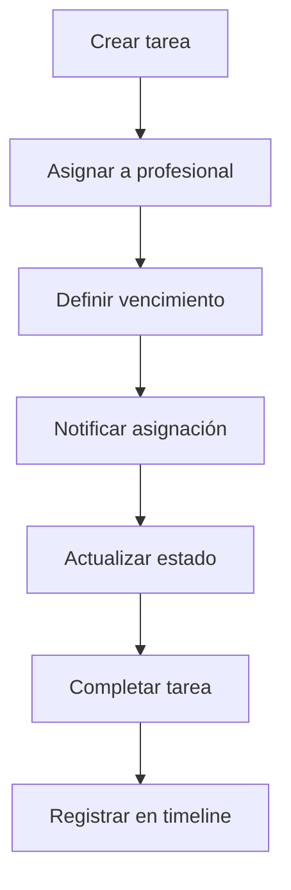
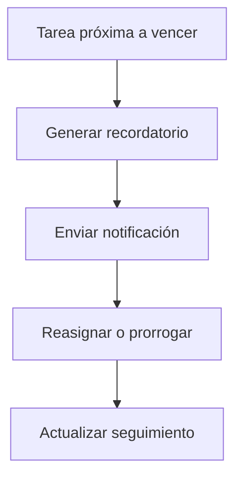

# ✅ Tareas & Seguimiento
*Exportado el 2025-10-22 21:34:54*
---

> **Nota:** Documentación del módulo de gestión de recordatorios internos y tareas por profesional con seguimiento y notificaciones.

# 🎯 Objetivo

Centralizar la asignación, seguimiento y notificación de tareas internas relacionadas con pacientes y procesos clínicos.

# 🔄 Diagramas de Flujo de Tareas

## 📌 Flujo de Creación y Asignación



## ⏰ Flujo de Recordatorios Internos



# 📊 Matrices de Seguimiento

<!-- Bloque no procesado: table -->

# ⚙️ Configuraciones de Recordatorios

- Frecuencias (inmediato, 24h, 48h)
- Canales internos (in-app/email)
- Reglas por prioridad y rol
# 🧩 Componentes React

- TareasManager: gestión central de tareas
- RecordatoriosInternos: configuración y disparo
- TareasPorProfesional: vista por usuario
- SeguimientoTareas: estados y SLA
- NotificacionesTareas: avisos y escalamiento
# 🔌 APIs Requeridas

```bash
GET /api/paciente/:id/tareas
POST /api/paciente/:id/tareas
PUT /api/paciente/:id/tareas/:tareaId
GET /api/paciente/:id/recordatorios
POST /api/paciente/:id/recordatorios
```

# 🗂️ Estructura MERN

```bash
paciente-360/tareas-seguimiento/
├─ page.tsx
├─ api/
│  ├─ tareas.ts
│  ├─ tarea-actualizar.ts
│  ├─ recordatorios.ts
└─ components/
   ├─ TareasManager.tsx
   ├─ RecordatoriosInternos.tsx
   ├─ TareasPorProfesional.tsx
   ├─ SeguimientoTareas.tsx
   └─ NotificacionesTareas.tsx
```

# 📋 Documentación de Procesos

1. Creación y asignación de tareas
1. Seguimiento de estados y SLA
1. Recordatorios y escalamiento
1. Cierre y reporte de tareas
> **Nota:** Esta página documenta el módulo. Ajustar SLAs y reglas de recordatorios según la política de cada clínica.

