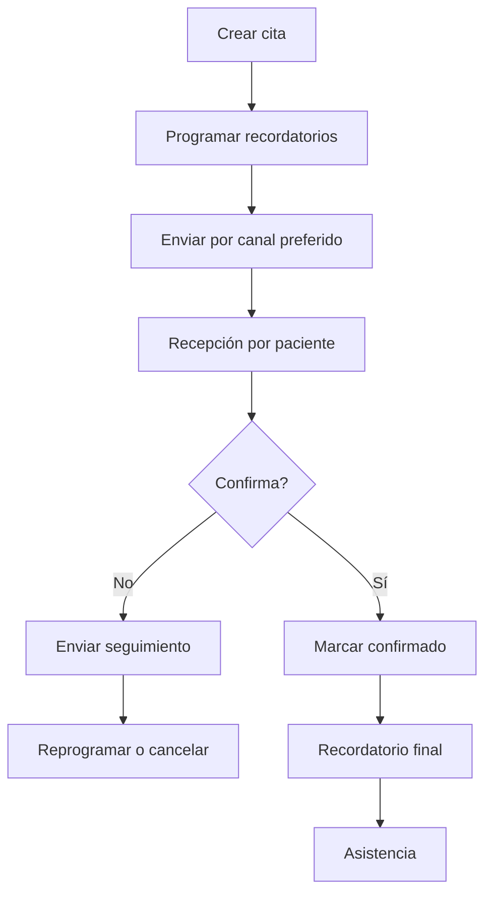
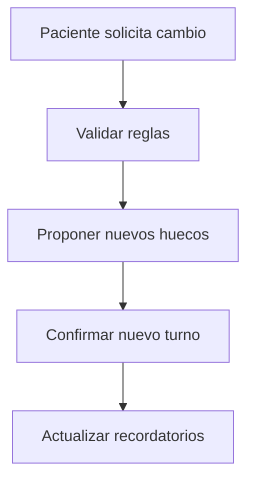

# ✉️ Recordatorios & Confirmaciones
*Exportado el 2025-10-22 21:34:45*
---

> **Nota:** Documentación del módulo de recordatorios multicanal (SMS/WhatsApp/Email), confirmaciones automáticas, reprogramaciones y control de no-shows.

# 🎯 Objetivo

Reducir no‑shows y mejorar la comunicación con los pacientes mediante recordatorios y confirmaciones automatizadas.

# 🔄 Diagramas de Flujo de Comunicaciones

## 📅 Flujo de Recordatorios Automáticos



## 🔁 Flujo de Reprogramaciones



# 📊 Matrices de Canales

<!-- Bloque no procesado: table -->

# ⚙️ Configuraciones de Recordatorios

- Ventanas de envío (48h, 24h, 2h)
- Plantillas por especialidad
- Canal preferido por paciente
# 🧩 Componentes React

- RecordatoriosManager: reglas y programación
- ConfirmacionesAutomaticas: captura de confirmación
- Reprogramaciones: propuesta de nuevos turnos
- NoShowsControl: seguimiento y métricas
- ComunicacionesMultiCanal: envío SMS/WhatsApp/Email
# 🔌 APIs Requeridas

```bash
POST /api/recordatorios/enviar
GET /api/recordatorios/historial
POST /api/recordatorios/reprogramar
GET /api/recordatorios/no-shows
PUT /api/recordatorios/estado/:id
```

# 🗂️ Estructura MERN

```bash
operacion-diaria/recordatorios-confirmaciones/
├─ page.tsx
├─ api/
│  ├─ enviar.ts
│  ├─ historial.ts
│  ├─ reprogramar.ts
│  ├─ no-shows.ts
│  └─ estado.ts
└─ components/
   ├─ RecordatoriosManager.tsx
   ├─ ConfirmacionesAutomaticas.tsx
   ├─ Reprogramaciones.tsx
   ├─ NoShowsControl.tsx
   └─ ComunicacionesMultiCanal.tsx
```

# 📋 Documentación de Procesos

1. Programación automática tras creación de cita
1. Secuencia multicanal con fallback
1. Captura de confirmación y actualización de estado
1. Gestión de reprogramaciones
1. Control y reporting de no-shows
> **Nota:** Esta página documenta el módulo y puede requerir ajustes regulatorios por país.

