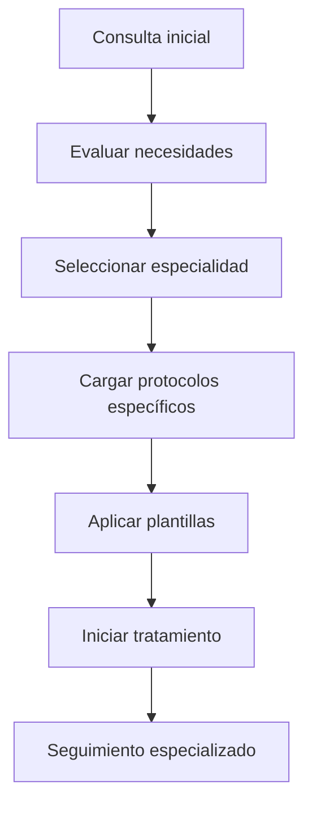

# 🏥 Especialidades
*Exportado el 2025-10-22 21:34:58*
---

> **Nota:** Documentación del módulo de gestión de especialidades dentales: odontología general, ortodoncia, implantología, endodoncia, periodoncia, prótesis, odontopediatría, estética, oclusión & ATM, sueño.

# 🎯 Objetivo

Centralizar la gestión de todas las especialidades dentales con protocolos específicos, plantillas personalizadas y flujos de trabajo adaptados a cada área de la odontología.

# 🔄 Diagramas de Flujo de Especialidades

## 📋 Flujo de Selección de Especialidad



## 🔄 Flujo de Gestión Multi-Especialidad

```mermaid
graph TD
    A[Paciente complejo] --> B[Evaluación multidisciplinar]
    B --> C[Coordinación entre especialidades]
    C --> D[Plan de tratamiento integrado]
    D --> E[Seguimiento coordinado]
    E --> F[Resultado final
```

# 📊 Matrices de Protocolos

<!-- Bloque no procesado: table -->

# ⚙️ Configuraciones de Plantillas

- Plantillas por especialidad personalizables
- Protocolos de diagnóstico específicos
- Formularios de consentimiento especializados
- Plantillas de seguimiento por especialidad
- Integración con terminología especializada
# 🧩 Componentes React

- EspecialidadesManager: gestión central de especialidades
- OdontologiaGeneral: protocolos de odontología general
- Ortodoncia: gestión de tratamientos ortodónticos
- Implantologia: protocolos de implantes
- Endodoncia: tratamientos endodónticos
- Periodoncia: tratamientos periodontales
- Protesis: gestión de prótesis
- Odontopediatria: tratamientos pediátricos
- Estetica: tratamientos estéticos
- OclusionATM: trastornos de ATM
- Sueo: medicina del sueño
# 🔌 APIs Requeridas

```bash
GET /api/especialidades/lista
GET /api/especialidades/:especialidad
POST /api/especialidades/registro
PUT /api/especialidades/:id
GET /api/especialidades/plantillas/:especialidad
```

# 🗂️ Estructura MERN

```bash
historia-clinica/especialidades/
├─ page.tsx
├─ api/
│  ├─ especialidades-lista.ts
│  ├─ especialidad-detalle.ts
│  ├─ especialidades-registro.ts
│  ├─ especialidades-actualizar.ts
│  └─ especialidades-plantillas.ts
└─ components/
   ├─ EspecialidadesManager.tsx
   ├─ OdontologiaGeneral.tsx
   ├─ Ortodoncia.tsx
   ├─ Implantologia.tsx
   ├─ Endodoncia.tsx
   ├─ Periodoncia.tsx
   ├─ Protesis.tsx
   ├─ Odontopediatria.tsx
   ├─ Estetica.tsx
   ├─ OclusionATM.tsx
   └─ Sueo.tsx
```

# 📋 Documentación de Procesos

1. Evaluación inicial y selección de especialidad
1. Aplicación de protocolos específicos
1. Coordinación entre especialidades
1. Seguimiento especializado
1. Documentación especializada
> **Nota:** Esta página documenta el módulo. Cada especialidad debe seguir sus protocolos específicos y normativas profesionales correspondientes.

