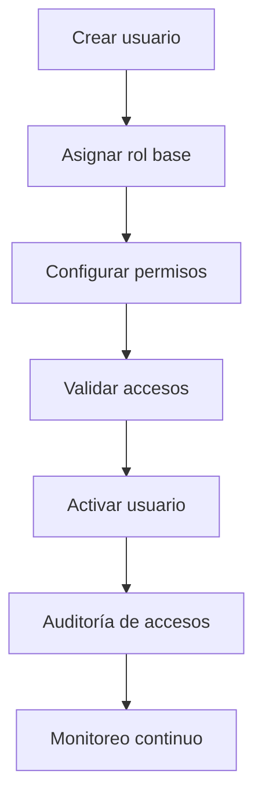
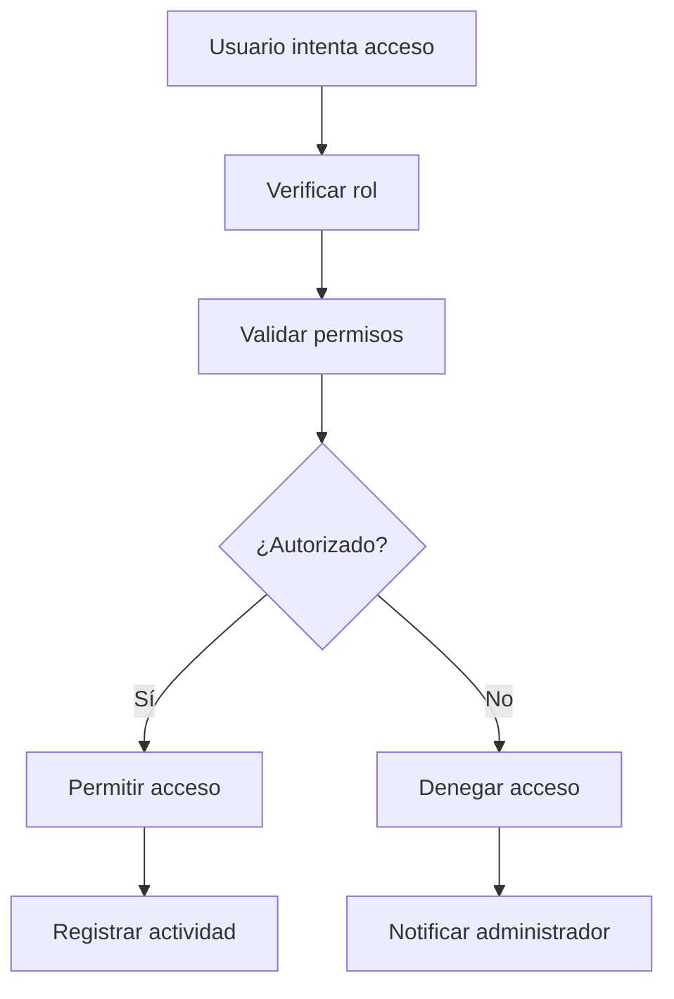

# 👥 Gestión de Roles Operación
*Exportado el 2025-10-22 21:34:48*
---

> **Nota:** Documentación del módulo de gestión de roles para Recepción, Coordinador y Gerencia con control de permisos y accesos.

# 🎯 Objetivo

Definir y gestionar los roles operativos del ERP dental, estableciendo permisos específicos para cada nivel de acceso (Recepción, Coordinador, Gerencia) y asegurando la seguridad de la información.

# 🔄 Diagramas de Flujo de Roles

## 👤 Flujo de Asignación de Roles



## 🔐 Flujo de Control de Accesos



# 📊 Matrices de Permisos

<!-- Bloque no procesado: table -->

# ⚙️ Configuraciones de Accesos

- Roles predefinidos por jerarquía
- Permisos granulares por módulo
- Horarios de acceso por rol
- Políticas de contraseñas
- Autenticación de dos factores
# 🧩 Componentes React

- RolesManager: gestión de roles y usuarios
- PermisosConfig: configuración de permisos
- UsuariosAsignacion: asignación de roles
- AccesosControl: control de accesos en tiempo real
- AuditoriaRoles: seguimiento y auditoría
# 🔌 APIs Requeridas

```bash
GET /api/roles/lista
POST /api/roles/crear
PUT /api/roles/:id
DELETE /api/roles/:id
GET /api/roles/permisos
POST /api/roles/asignar
```

# 🗂️ Estructura MERN

```bash
operacion-diaria/gestion-roles/
├─ page.tsx
├─ api/
│  ├─ lista.ts
│  ├─ crear.ts
│  ├─ actualizar.ts
│  ├─ eliminar.ts
│  ├─ permisos.ts
│  └─ asignar.ts
└─ components/
   ├─ RolesManager.tsx
   ├─ PermisosConfig.tsx
   ├─ UsuariosAsignacion.tsx
   ├─ AccesosControl.tsx
   └─ AuditoriaRoles.tsx
```

# 📋 Documentación de Procesos

1. Creación y configuración de roles base
1. Asignación de permisos por funcionalidad
1. Asignación de usuarios a roles
1. Validación de accesos en tiempo real
1. Auditoría y seguimiento de actividades
> **Nota:** Esta página documenta el módulo. Los permisos deben revisarse periódicamente para mantener la seguridad.

