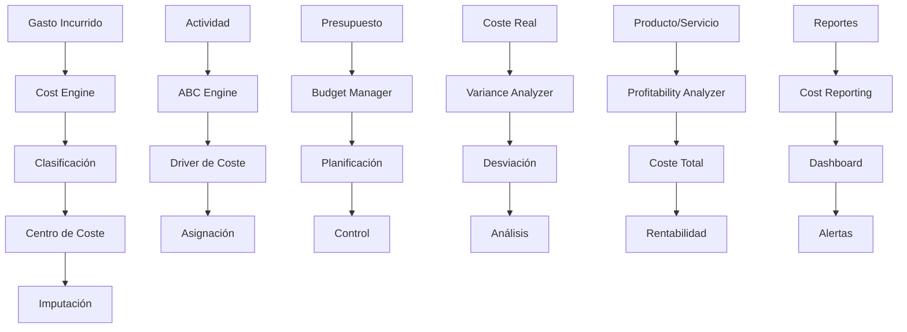

# 💰 Presupuestos & Costes
*Exportado el 2025-10-22 21:34:59*
---

# 💰 Módulo de Presupuestos y Costes

Este módulo proporciona capacidades completas de gestión de presupuestos y costes para el ERP, incluyendo centros de coste, activity-based costing, presupuestos anuales, análisis de desviaciones, costes estándar, imputación de gastos, análisis de rentabilidad y reportes de costes con control presupuestario avanzado y optimización de costes.

## 🏗️ Arquitectura de Costes

La arquitectura de costes está diseñada para proporcionar visibilidad completa y control de costes:

- Cost Engine - Motor principal de cálculo de costes
- Budget Manager - Gestor de presupuestos y planificación
- Cost Center Manager - Gestor de centros de coste
- ABC Engine - Motor de Activity-Based Costing
- Variance Analyzer - Analizador de desviaciones
- Profitability Analyzer - Analizador de rentabilidad
- Cost Reporting Engine - Motor de reportes de costes
### 📊 Diagrama de Flujo de Costes



## 🔄 Flujos de Costes

El sistema implementa múltiples flujos para la gestión de costes:

### 📊 Flujo de Activity-Based Costing

1. Identificación de actividades y procesos clave
1. Definición de drivers de coste para cada actividad
1. Medición del consumo de recursos por actividad
1. Asignación de costes indirectos a productos/servicios
1. Cálculo del coste total por producto/servicio
1. Análisis de rentabilidad por producto/servicio
## 📋 Matrices de Centros

El sistema gestiona centros de coste con diferentes niveles de responsabilidad:

<!-- Bloque no procesado: table -->

## 📊 Configuraciones de Presupuestos

El sistema configura automáticamente presupuestos con diferentes metodologías:

### ⚙️ Configuración de Presupuestos

```json
{
  "budget_configuration": {
    "budget_types": [
      {
        "type": "annual",
        "period": "12_months",
        "revision_frequency": "quarterly"
      },
      {
        "type": "rolling",
        "period": "12_months",
        "revision_frequency": "monthly"
      }
    ],
    "budget_methods": [
      {
        "method": "incremental",
        "base_year": "previous_year",
        "growth_rate": 0.05
      },
      {
        "method": "zero_based",
        "justification_required": true
      }
    ],
    "approval_workflow": {
      "levels": [
        {
          "level": 1,
          "amount_threshold": 10000,
          "approver_role": "manager"
        },
        {
          "level": 2,
          "amount_threshold": 50000,
          "approver_role": "director"
        }
      ]
    }
  }
}
```

## 📅 Presupuestos Anuales

El sistema gestiona presupuestos anuales con múltiples metodologías:

### 📋 Metodologías de Presupuesto

- Presupuesto Incremental - Basado en el año anterior con crecimiento
- Presupuesto Base Cero - Justificación de cada partida
- Presupuesto Rolling - Actualización continua de 12 meses
- Presupuesto Flexible - Adaptación a diferentes niveles de actividad
## 📊 Análisis de Desviaciones

El sistema analiza automáticamente desviaciones presupuestarias:

### 📋 Tipos de Desviaciones

- Desviación de Volumen - Diferencia por cambio en actividad
- Desviación de Precio - Diferencia por cambio en precios
- Desviación de Eficiencia - Diferencia por cambio en productividad
- Desviación Mixta - Combinación de factores
## 📏 Costes Estándar

El sistema gestiona costes estándar para control y análisis:

### 📋 Tipos de Costes Estándar

- Coste Estándar Ideal - Condiciones óptimas de producción
- Coste Estándar Normal - Condiciones normales de producción
- Coste Estándar Básico - Coste base para comparaciones
- Coste Estándar Actual - Coste actualizado regularmente
## 💸 Imputación de Gastos

El sistema automatiza la imputación de gastos a centros de coste:

### 📋 Métodos de Imputación

- Imputación Directa - Asignación directa a centro de coste
- Imputación por Prorrata - Distribución proporcional
- Imputación por Actividad - Basada en drivers de coste
- Imputación por Superficie - Distribución por metros cuadrados
## 📈 Análisis de Rentabilidad

El sistema proporciona análisis de rentabilidad por producto, cliente y centro:

### 📊 Métricas de Rentabilidad

- Margen Bruto - Diferencia entre ingresos y costes directos
- Margen de Contribución - Diferencia entre ingresos y costes variables
- ROI (Return on Investment) - Rentabilidad sobre inversión
- ROA (Return on Assets) - Rentabilidad sobre activos
## 📋 Subpáginas del Módulo

Este módulo se expandirá con las siguientes subpáginas especializadas:

- 🏢 Centros de Coste - Gestión de centros de coste y responsabilidades
- 📊 Activity-Based Costing - Costeo basado en actividades
- 📅 Presupuestos Anuales - Planificación y control presupuestario
- 📊 Análisis de Desviaciones - Control de desviaciones presupuestarias
- 📏 Costes Estándar - Gestión de costes estándar
- 💸 Imputación de Gastos - Automatización de imputaciones
- 📈 Análisis de Rentabilidad - Análisis de rentabilidad por segmento
- 📋 Reportes de Costes - Reportes de gestión de costes
## ⚙️ Documentación de Procesos

### 🌐 APIs de Presupuestos y Costes

```json
{
  "budget_management": {
    "create_budget": "POST /api/v1/budgets",
    "get_budget": "GET /api/v1/budgets/{budgetId}",
    "update_budget": "PUT /api/v1/budgets/{budgetId}",
    "approve_budget": "POST /api/v1/budgets/{budgetId}/approve"
  },
  "cost_management": {
    "calculate_cost": "POST /api/v1/costs/calculate",
    "get_cost_center": "GET /api/v1/cost-centers/{centerId}",
    "allocate_cost": "POST /api/v1/costs/allocate"
  },
  "variance_analysis": {
    "analyze_variance": "POST /api/v1/variance/analyze",
    "get_variance_report": "GET /api/v1/variance/reports/{reportId}",
    "get_budget_vs_actual": "GET /api/v1/budgets/{budgetId}/vs-actual"
  },
  "profitability_analysis": {
    "analyze_profitability": "POST /api/v1/profitability/analyze",
    "get_product_profitability": "GET /api/v1/profitability/products/{productId}",
    "get_customer_profitability": "GET /api/v1/profitability/customers/{customerId}"
  },
  "abc_costing": {
    "define_activities": "POST /api/v1/abc/activities",
    "set_cost_drivers": "POST /api/v1/abc/drivers",
    "calculate_abc_costs": "POST /api/v1/abc/calculate"
  }
}
```

### ⚙️ Configuración de Costes

El sistema permite configurar múltiples aspectos de costes:

- Configuración de Centros de Coste - Estructura jerárquica y responsabilidades
- Configuración de ABC - Actividades y drivers de coste
- Configuración de Presupuestos - Metodologías y flujos de aprobación
- Configuración de Imputaciones - Reglas de asignación de costes
### 📊 Métricas de Costes

El sistema proporciona métricas para optimizar la gestión de costes:

- Precisión de Costes - Exactitud en la asignación de costes
- Eficiencia Presupuestaria - Cumplimiento de presupuestos por centro
- Tiempo de Cierre - Tiempo promedio de cierre de costes
- Desviaciones Críticas - Número de desviaciones que requieren atención
- Rentabilidad por Segmento - Análisis de rentabilidad por producto/cliente
## ⚡ Notas de Implementación

Esta documentación será actualizada conforme se desarrollen las subpáginas especializadas. Cada subpágina contendrá documentación técnica detallada, diagramas de flujo específicos y ejemplos de configuración para su respectivo dominio de presupuestos y costes.

> **Nota:** Importante: Esta página sirve como documentación principal del módulo. Las subpáginas especializadas se crearán en futuras iteraciones del desarrollo.

