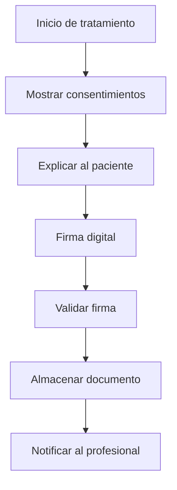
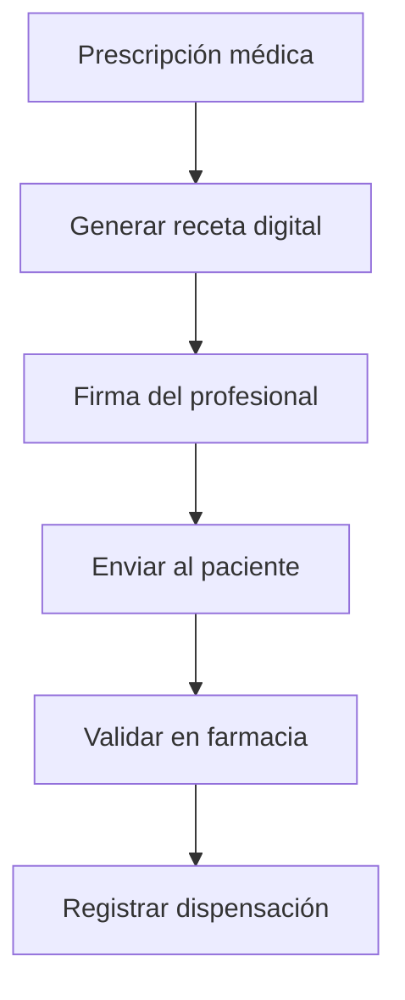

# 📄 Documentos & Firmas
*Exportado el 2025-10-22 21:34:51*
---

> **Nota:** Documentación del módulo de gestión de consentimientos RGPD/específicos, recetas digitales y adjuntos con firmas digitales.

# 🎯 Objetivo

Gestionar de forma digital y segura todos los documentos del paciente, incluyendo consentimientos RGPD, consentimientos específicos de tratamientos, recetas digitales y adjuntos, con sistema de firmas digitales integrado.

# 🔄 Diagramas de Flujo de Documentos

## 📝 Flujo de Gestión de Consentimientos



## 💊 Flujo de Recetas Digitales



# 📊 Matrices de Consentimientos

<!-- Bloque no procesado: table -->

# ⚙️ Configuraciones de Firmas

- Firma biométrica (tablet/kiosko)
- Firma digital con certificado
- Validación de identidad previa
- Almacenamiento seguro con encriptación
- Auditoría de firmas y accesos
# 🧩 Componentes React

- DocumentosManager: gestión central de documentos
- ConsentimientosRGPD: formularios de consentimiento
- RecetasDigitales: prescripción y dispensación
- AdjuntosManager: gestión de archivos adjuntos
- FirmasDigitales: captura y validación de firmas
# 🔌 APIs Requeridas

```bash
GET /api/paciente/:id/documentos
POST /api/paciente/:id/documentos
POST /api/paciente/:id/consentimientos
GET /api/paciente/:id/recetas
POST /api/paciente/:id/firmar
```

# 🗂️ Estructura MERN

```bash
paciente-360/documentos-firmas/
├─ page.tsx
├─ api/
│  ├─ documentos.ts
│  ├─ consentimientos.ts
│  ├─ recetas.ts
│  └─ firmar.ts
└─ components/
   ├─ DocumentosManager.tsx
   ├─ ConsentimientosRGPD.tsx
   ├─ RecetasDigitales.tsx
   ├─ AdjuntosManager.tsx
   └─ FirmasDigitales.tsx
```

# 📋 Documentación de Procesos

1. Presentación de consentimientos al paciente
1. Captura y validación de firmas digitales
1. Generación y envío de recetas digitales
1. Gestión de adjuntos y archivos
1. Auditoría y seguimiento de documentos
> **Nota:** Esta página documenta el módulo. El cumplimiento RGPD es obligatorio y debe revisarse periódicamente.

