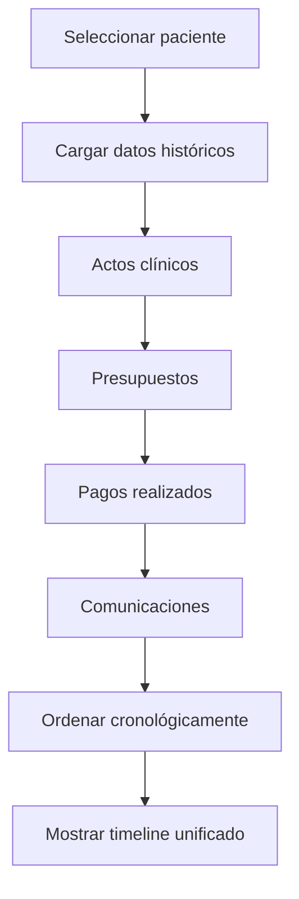
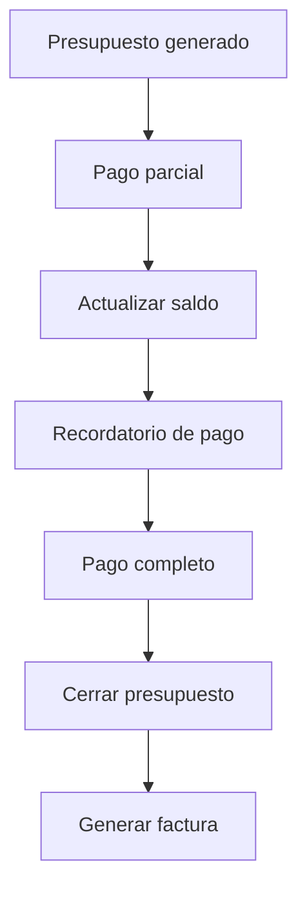

# 📅 Timeline Clínico-Económico
*Exportado el 2025-10-22 21:34:53*
---

> **Nota:** Documentación del módulo de timeline completo con actos clínicos, presupuestos, pagos y comunicaciones para seguimiento integral del paciente.

# 🎯 Objetivo

Proporcionar una vista cronológica completa de la relación clínica y económica con el paciente, integrando actos médicos, presupuestos, pagos y comunicaciones en una línea de tiempo unificada.

# 🔄 Diagramas de Flujo de Timeline

## 📈 Flujo de Construcción de Timeline



## 💰 Flujo de Seguimiento Económico



# 📊 Matrices de Actos Clínicos

<!-- Bloque no procesado: table -->

# ⚙️ Configuraciones de Presupuestos

- Plantillas por especialidad
- Descuentos automáticos por volumen
- Plazos de validez configurables
- Aprobaciones por importe
- Seguimiento de modificaciones
# 🧩 Componentes React

- TimelineViewer: visualización cronológica principal
- ActosClinicos: gestión de actos médicos
- PresupuestosHistorial: seguimiento de presupuestos
- PagosSeguimiento: control de pagos y saldos
- ComunicacionesTimeline: registro de comunicaciones
# 🔌 APIs Requeridas

```bash
GET /api/paciente/:id/timeline
GET /api/paciente/:id/actos
GET /api/paciente/:id/presupuestos
GET /api/paciente/:id/pagos
GET /api/paciente/:id/comunicaciones
```

# 🗂️ Estructura MERN

```bash
paciente-360/timeline-clinico-economico/
├─ page.tsx
├─ api/
│  ├─ timeline.ts
│  ├─ actos.ts
│  ├─ presupuestos.ts
│  ├─ pagos.ts
│  └─ comunicaciones.ts
└─ components/
   ├─ TimelineViewer.tsx
   ├─ ActosClinicos.tsx
   ├─ PresupuestosHistorial.tsx
   ├─ PagosSeguimiento.tsx
   └─ ComunicacionesTimeline.tsx
```

# 📋 Documentación de Procesos

1. Recopilación de datos históricos del paciente
1. Ordenación cronológica de eventos
1. Visualización integrada clínica-económica
1. Seguimiento de pagos y saldos pendientes
1. Generación de reportes de seguimiento
> **Nota:** Esta página documenta el módulo. La información económica debe cumplir con normativas de facturación y protección de datos.

