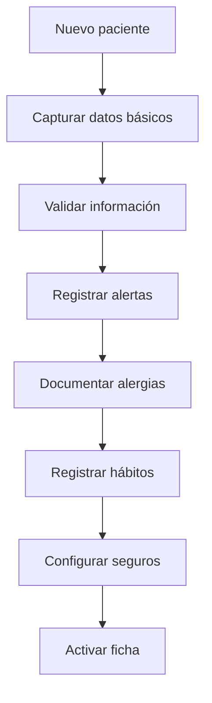
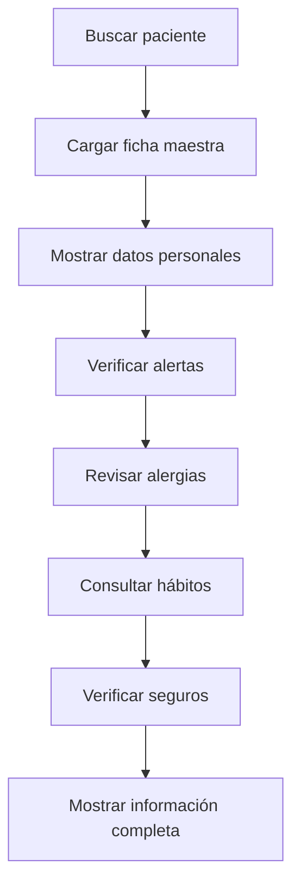

# 📋 Ficha Maestra
*Exportado el 2025-10-22 21:34:49*
---

> **Nota:** Documentación del módulo de ficha completa del paciente con datos personales, alertas clínicas, alergias, hábitos y información de seguros.

# 🎯 Objetivo

Centralizar toda la información del paciente en una ficha maestra única, proporcionando acceso rápido a datos personales, alertas clínicas, alergias, hábitos y cobertura de seguros para una atención integral.

# 🔄 Diagramas de Flujo de Ficha Paciente

## 📝 Flujo de Creación de Ficha



## 🔍 Flujo de Consulta de Ficha



# 📊 Matrices de Datos Personales

<!-- Bloque no procesado: table -->

# ⚙️ Configuraciones de Alertas

- Alertas clínicas por gravedad (Alta, Media, Baja)
- Alertas de alergias con códigos específicos
- Alertas de medicamentos contraindicados
- Alertas de hábitos de riesgo
- Notificaciones automáticas al personal
# 🧩 Componentes React

- FichaPaciente: componente principal de la ficha
- DatosPersonales: gestión de información básica
- AlertasClinicas: visualización y gestión de alertas
- AlergiasManager: registro y seguimiento de alergias
- HabitosPaciente: registro de hábitos y factores de riesgo
- SegurosInfo: gestión de cobertura y seguros
# 🔌 APIs Requeridas

```bash
GET /api/paciente/:id
PUT /api/paciente/:id
GET /api/paciente/:id/alertas
POST /api/paciente/:id/alergias
GET /api/paciente/:id/seguros
```

# 🗂️ Estructura MERN

```bash
paciente-360/ficha-maestra/
├─ page.tsx
├─ api/
│  ├─ paciente.ts
│  ├─ alertas.ts
│  ├─ alergias.ts
│  └─ seguros.ts
└─ components/
   ├─ FichaPaciente.tsx
   ├─ DatosPersonales.tsx
   ├─ AlertasClinicas.tsx
   ├─ AlergiasManager.tsx
   ├─ HabitosPaciente.tsx
   └─ SegurosInfo.tsx
```

# 📋 Documentación de Procesos

1. Registro inicial de datos personales
1. Configuración de alertas clínicas
1. Registro y seguimiento de alergias
1. Documentación de hábitos y factores de riesgo
1. Gestión de información de seguros
> **Nota:** Esta página documenta el módulo. La información médica debe cumplir con normativas de protección de datos (GDPR/LOPD).

