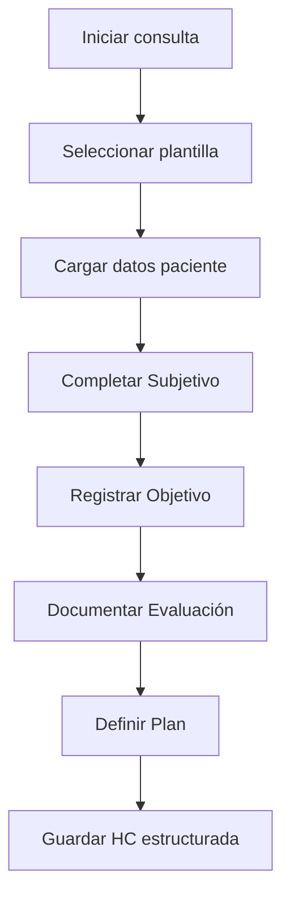
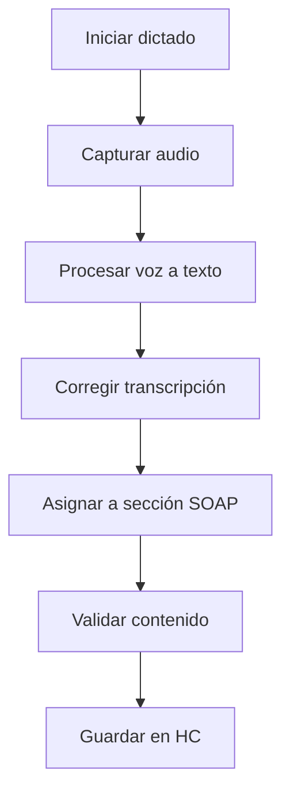

# 📋 HC Estructurada
*Exportado el 2025-10-22 21:35:04*
---

> **Nota:** Documentación del módulo de historia clínica estructurada con SOAP, plantillas por especialidad y dictado por voz.

# 🎯 Objetivo

Proporcionar un sistema estructurado para la documentación clínica siguiendo el formato SOAP, con plantillas especializadas y funcionalidad de dictado por voz para mejorar la eficiencia del profesional.

# 🔄 Diagramas de Flujo de HC Estructurada

## 📝 Flujo de Creación de HC SOAP



## 🎤 Flujo de Dictado por Voz



# 📊 Matrices de Plantillas SOAP

<!-- Bloque no procesado: table -->

# ⚙️ Configuraciones de Especialidades

- Plantillas personalizables por especialidad
- Campos obligatorios configurables
- Validaciones automáticas de contenido
- Integración con terminología médica
- Exportación a formatos estándar
# 🧩 Componentes React

- HCEstructurada: editor principal de HC
- PlantillasSOAP: gestión de plantillas
- PlantillasEspecialidad: plantillas por especialidad
- DictadoVoz: captura y transcripción
- EditorHC: editor avanzado de texto
# 🔌 APIs Requeridas

```bash
GET /api/hc/plantillas
POST /api/hc/registro
GET /api/hc/:id
PUT /api/hc/:id
POST /api/hc/dictado
```

# 🗂️ Estructura MERN

```bash
historia-clinica/hc-estructurada/
├─ page.tsx
├─ api/
│  ├─ plantillas.ts
│  ├─ registro.ts
│  ├─ hc-id.ts
│  └─ dictado.ts
└─ components/
   ├─ HCEstructurada.tsx
   ├─ PlantillasSOAP.tsx
   ├─ PlantillasEspecialidad.tsx
   ├─ DictadoVoz.tsx
   └─ EditorHC.tsx
```

# 📋 Documentación de Procesos

1. Selección de plantilla por especialidad
1. Completado de secciones SOAP
1. Dictado y transcripción de voz
1. Validación y guardado de HC
1. Exportación y firma digital
> **Nota:** Esta página documenta el módulo. La HC estructurada debe cumplir con normativas médicas y de protección de datos.

