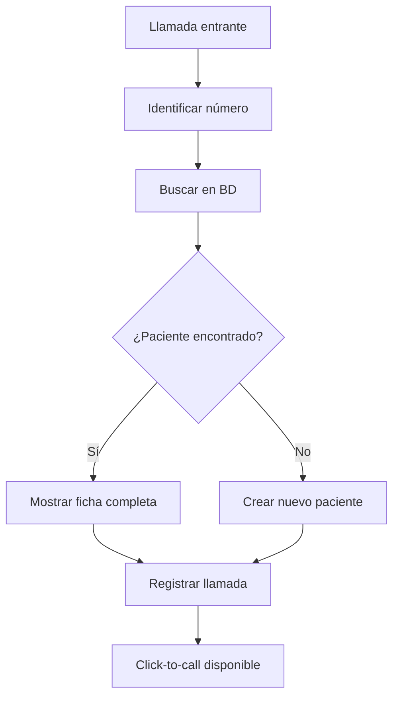
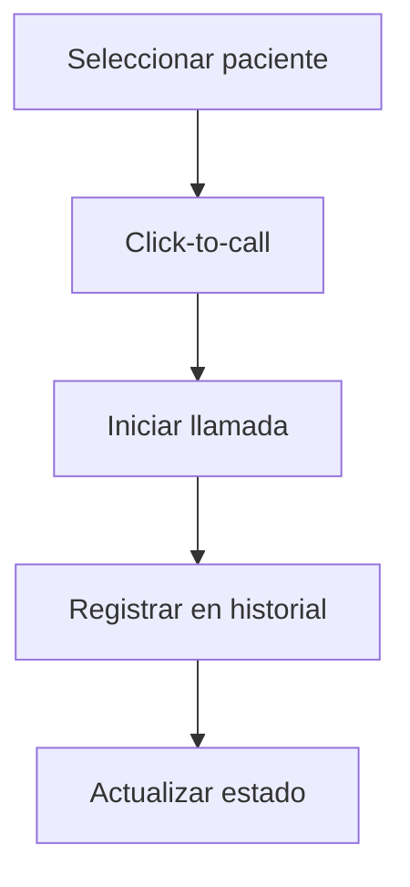

# 📞 Contact Center
*Exportado el 2025-10-22 21:34:47*
---

> **Nota:** Documentación del módulo de Contact Center con sistema CTI/telefónica, pop-ups de ficha paciente y click-to-call integrado.

# 🎯 Objetivo

Integrar la comunicación telefónica con el ERP dental, proporcionando información contextual del paciente y facilitando la gestión de llamadas desde el sistema.

# 🔄 Diagramas de Flujo de Contact Center

## 📞 Flujo de Llamada Entrante



## 📤 Flujo de Llamada Saliente



# 📊 Matrices de CTI

<!-- Bloque no procesado: table -->

# ⚙️ Configuraciones de Telefonía

- Integración con centralitas IP
- Configuración de números de teléfono
- Reglas de enrutamiento de llamadas
- Grabación de llamadas (GDPR)
# 🧩 Componentes React

- ContactCenterDashboard: panel principal de llamadas
- CTITelefonia: integración con centralita
- FichaPacientePopup: información contextual
- ClickToCall: botón de llamada directa
- HistorialLlamadas: registro y búsqueda
# 🔌 APIs Requeridas

```bash
GET /api/contact-center/llamadas
POST /api/contact-center/llamar
GET /api/contact-center/paciente/:id
POST /api/contact-center/registrar
GET /api/contact-center/historial
```

# 🗂️ Estructura MERN

```bash
operacion-diaria/contact-center/
├─ page.tsx
├─ api/
│  ├─ llamadas.ts
│  ├─ llamar.ts
│  ├─ paciente.ts
│  ├─ registrar.ts
│  └─ historial.ts
└─ components/
   ├─ ContactCenterDashboard.tsx
   ├─ CTITelefonia.tsx
   ├─ FichaPacientePopup.tsx
   ├─ ClickToCall.tsx
   └─ HistorialLlamadas.tsx
```

# 📋 Documentación de Procesos

1. Identificación automática de llamadas entrantes
1. Búsqueda y visualización de ficha del paciente
1. Registro automático de llamadas en historial
1. Click-to-call desde cualquier pantalla
1. Gestión de estados y seguimiento
> **Nota:** Esta página documenta el módulo. La implementación requiere integración con sistemas telefónicos específicos.

