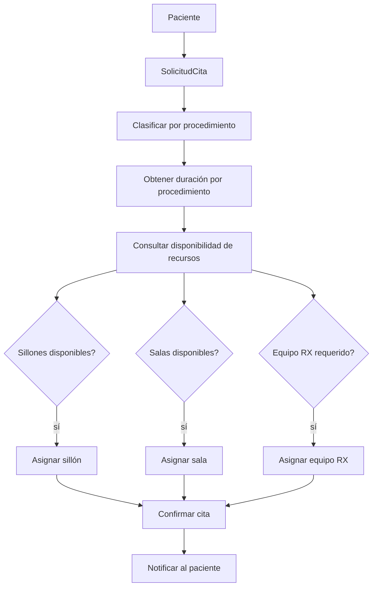

# 🗓️ Planificación de Recursos
*Exportado el 2025-10-22 21:35:01*
---

# 🗓️ Planificación de Recursos (ERP Dental)

Documentación del módulo de gestión de sillones, salas, equipo RX y duración por procedimiento.

## 📊 Diagrama de Flujo de Recursos



## 🪑 Matrices de Sillones y Salas

<!-- Bloque no procesado: table -->

## ⚙️ Configuraciones de Equipos

- Sillones: etiquetas por especialidad, bloqueo por mantenimiento, buffers entre citas
- Salas: capacidad, equipamiento, reglas de sobrecupo
- Equipo RX: disponibilidad por técnico, ventanas de calentamiento, cumplimiento
## 🧩 Componentes React (MERN)

```typescript
// RecursosManager.tsx
export function RecursosManager() { /* ... */ }
// SillonesScheduler.tsx
export function SillonesScheduler() { /* ... */ }
// SalasManager.tsx
export function SalasManager() { /* ... */ }
// EquipoRXControl.tsx
export function EquipoRXControl() { /* ... */ }
// DuracionProcedimientos.ts
export function getProcedureDuration(code: string): number { /* ... */ }
```

## 🌐 APIs Requeridas

```json
{
  "GET /api/recursos/sillones": "Listado de sillones y estados",
  "GET /api/recursos/salas": "Listado de salas y disponibilidad",
  "GET /api/recursos/equipo-rx": "Listado de equipos RX y técnicos",
  "POST /api/recursos/asignar": "Asignar recurso a cita",
  "PUT /api/recursos/duracion/:id": "Actualizar duración por procedimiento"
}
```

## 📁 Estructura de Carpetas (MERN)

```bash
operacion-diaria/
  planificacion-recursos/
    page.tsx
    api/
      recursos.ts
    components/
      RecursosManager.tsx
      SillonesScheduler.tsx
      SalasManager.tsx
      EquipoRXControl.tsx
      DuracionProcedimientos.ts
```

## ⚙️ Documentación de Procesos

1. Definición de recursos y metadatos (sillones, salas, RX)
1. Sincronización de disponibilidad y bloqueos de agenda
1. Asignación automática por reglas y buffers
1. Gestión de cambios: reprogramaciones y conflictos
1. Monitoreo y alertas de utilización
> **Nota:** Esta es la documentación del módulo. No se crean subpáginas adicionales automáticamente.

