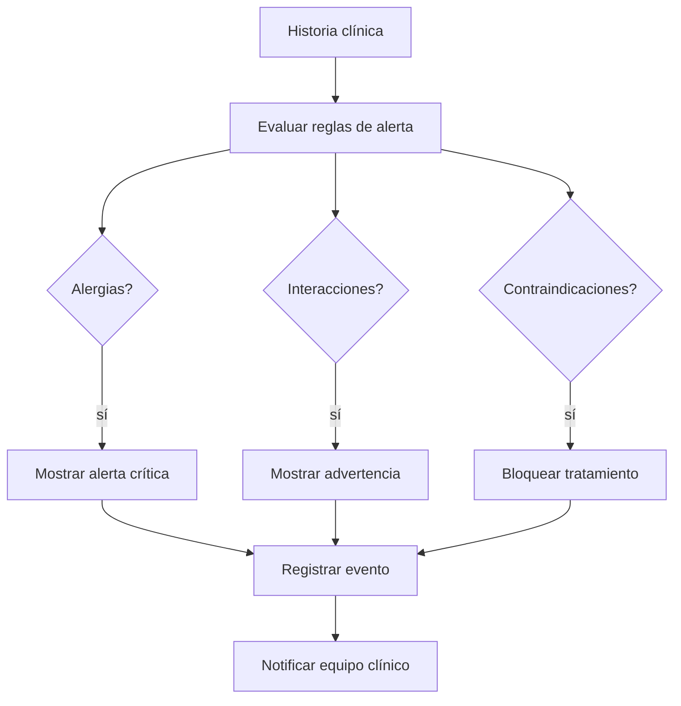

# 🚨 Alertas Clínicas & Contraindicaciones
*Exportado el 2025-10-22 21:35:07*
---

# 🚨 Alertas Clínicas & Contraindicaciones (ERP Dental)

Documentación del sistema de alertas clínicas, contraindicaciones de tratamientos e interacciones de medicamentos y alergias.

## 🔁 Diagrama de Flujo de Alertas



## 📋 Matriz de Contraindicaciones

<!-- Bloque no procesado: table -->

## ⚙️ Configuraciones de Interacciones

- Alergias por sustancia activa y excipientes
- Interacciones medicamento-medicamento y medicamento-tratamiento
- Niveles de severidad y acciones recomendadas
## 🧩 Componentes React (MERN)

```typescript
// AlertasClinicas.tsx
export function AlertasClinicas() { /* ... */ }
// Contraindicaciones.tsx
export function Contraindicaciones() { /* ... */ }
// InteraccionesMedicamentosas.tsx
export function InteraccionesMedicamentosas() { /* ... */ }
// AlertasAlergias.tsx
export function AlertasAlergias() { /* ... */ }
// SistemaAlertas.ts
export function SistemaAlertas() { /* motor de reglas */ }
```

## 🌐 APIs Requeridas

```json
{
  "GET /api/alertas/:pacienteId": "Listar alertas activas del paciente",
  "POST /api/alertas/crear": "Crear alerta manual o automática",
  "GET /api/contraindicaciones/:pacienteId": "Listar contraindicaciones",
  "POST /api/contraindicaciones/registrar": "Registrar contraindicación",
  "GET /api/interacciones/medicamentos": "Consultar interacciones de medicamentos"
}
```

## 📁 Estructura de Carpetas (MERN)

```bash
historia-clinica/
  alertas-contraindicaciones/
    page.tsx
    api/
      get-alertas.ts
      post-alerta.ts
      get-contraindicaciones.ts
      post-contraindicacion.ts
      get-interacciones-medicamentos.ts
    components/
      AlertasClinicas.tsx
      Contraindicaciones.tsx
      InteraccionesMedicamentosas.tsx
      AlertasAlergias.tsx
      SistemaAlertas.ts
```

## ⚙️ Documentación de Procesos

1. Captura de antecedentes, alergias y medicación
1. Evaluación de reglas y generación de alertas
1. Registro, notificación y seguimiento
> **Nota:** Documentación del módulo de alertas clínicas y contraindicaciones.

