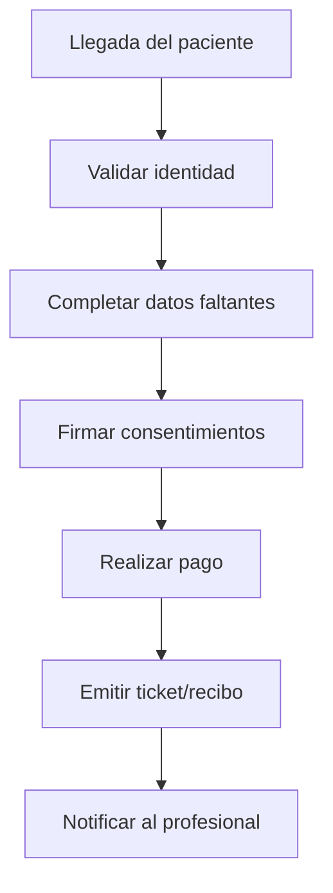
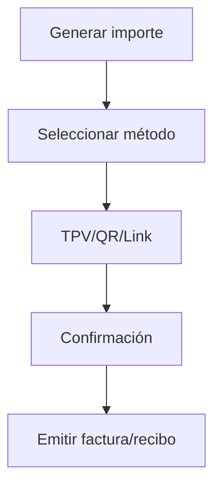

# 🛎️ Recepción & Check-in
*Exportado el 2025-10-22 21:34:43*
---

> **Nota:** Documentación del módulo de Recepción & Check-in con kiosko/tablet, firma de consentimientos y cobro rápido.

# 🎯 Objetivo

Digitalizar y agilizar el check-in del paciente, reducir tiempos de espera, asegurar cumplimiento (consentimientos) y facilitar cobro rápido.

# 🔄 Diagramas de Flujo de Recepción

## 📝 Flujo de Check-in en Kiosko



## 💳 Flujo de Cobro Rápido



# 📊 Matrices de Check-in

<!-- Bloque no procesado: table -->

# ⚙️ Configuraciones de Kiosko/Tablet

- Idiomas disponibles
- Accesibilidad (tamaño de fuente, alto contraste)
- Integración con lector de documentos
# 🧩 Componentes React

- KioskoTablet: flujo de auto-check-in
- FirmaConsentimientos: captura biométrica/OTP
- CobroRapido: integración TPV/QR/link
- CheckInPaciente: validación y estado
- ValidacionDocumentos: OCR/lectores
# 🔌 APIs Requeridas

```bash
POST /api/recepcion/checkin
POST /api/recepcion/consentimientos
POST /api/recepcion/cobro
GET /api/recepcion/paciente/:id
PUT /api/recepcion/estado/:id
```

# 🗂️ Estructura MERN

```bash
operacion-diaria/recepcion-checkin/
├─ page.tsx
├─ api/
│  ├─ checkin.ts
│  ├─ consentimientos.ts
│  ├─ cobro.ts
│  ├─ paciente.ts
│  └─ estado.ts
└─ components/
   ├─ KioskoTablet.tsx
   ├─ FirmaConsentimientos.tsx
   ├─ CobroRapido.tsx
   ├─ CheckInPaciente.tsx
   └─ ValidacionDocumentos.tsx
```

# 📋 Documentación de Procesos

1. Llegada y validación de identidad
1. Completar datos y cuestionarios
1. Firma de consentimientos
1. Cobro rápido y emisión de recibo
1. Notificación y espera
> **Nota:** Esta página documenta el módulo. Las implementaciones pueden requerir adaptaciones locales.

