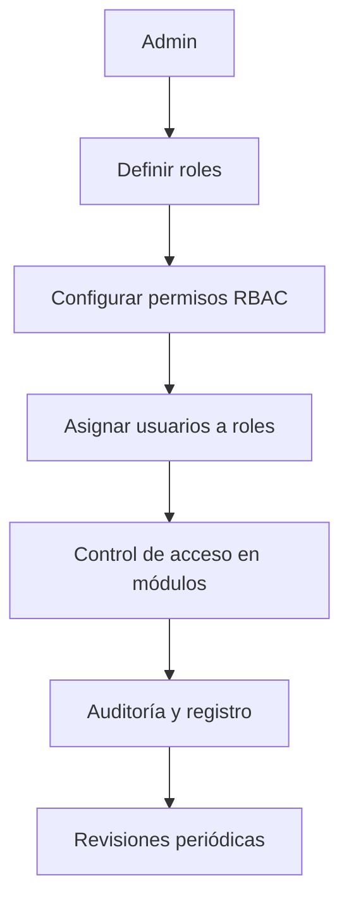

# 🛡️ Gestión de Roles CRM
*Exportado el 2025-10-22 21:35:03*
---

# 🛡️ Gestión de Roles CRM (ERP Dental)

Documentación del módulo de gestión de roles y permisos RBAC para usuarios del CRM dental.

## 🔁 Diagrama de Flujo de Roles CRM



## 🧮 Matriz de Permisos RBAC

<!-- Bloque no procesado: table -->

## ⚙️ Configuraciones de Acceso

- Permisos por módulo (Pacientes, Citas, Documentos, Facturación, Reportes)
- Reglas de acceso a datos del paciente por rol y relación
- Auditoría de cambios y accesos (cumplimiento)
## 🧩 Componentes React (MERN)

```typescript
// RolesCRMManager.tsx
export function RolesCRMManager() { /* ... */ }
// PermisosRBAC.tsx
export function PermisosRBAC() { /* ... */ }
// UsuariosAsignacionCRM.tsx
export function UsuariosAsignacionCRM() { /* ... */ }
// AccesosDatosPaciente.tsx
export function AccesosDatosPaciente() { /* ... */ }
// AuditoriaCRM.tsx
export function AuditoriaCRM() { /* ... */ }
```

## 🌐 APIs Requeridas

```json
{
  "GET /api/crm/roles": "Listar roles",
  "POST /api/crm/roles": "Crear/editar roles",
  "GET /api/crm/permisos": "Listar permisos por rol",
  "POST /api/crm/permisos/asignar": "Asignar permisos/roles a usuarios",
  "GET /api/crm/auditoria": "Eventos de auditoría de accesos y cambios"
}
```

## 📁 Estructura de Carpetas (MERN)

```bash
paciente-360/
  gestion-roles-crm/
    page.tsx
    api/
      roles.ts
      permisos.ts
      auditoria.ts
    components/
      RolesCRMManager.tsx
      PermisosRBAC.tsx
      UsuariosAsignacionCRM.tsx
      AccesosDatosPaciente.tsx
      AuditoriaCRM.tsx
```

## ⚙️ Documentación de Procesos

1. Definir roles base y herencia de permisos
1. Configurar permisos por recurso/acción (CRUD)
1. Asignar usuarios y grupos al CRM
1. Validaciones de acceso en frontend y backend
1. Auditoría y revisiones periódicas de permisos
> **Nota:** Esta documentación resume el módulo RBAC del CRM dental.

