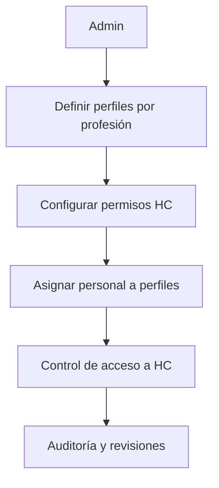

# 🛡️ Gestión de Roles HC
*Exportado el 2025-10-22 21:35:09*
---

# 🛡️ Gestión de Roles HC (ERP Dental)

Documentación del módulo de gestión de roles para Dentistas, Higienistas y Auxiliares con permisos específicos sobre Historia Clínica.

## 🔁 Diagrama de Flujo de Roles HC



## 🧮 Matriz de Permisos por Profesión

<!-- Bloque no procesado: table -->

## ⚙️ Configuraciones de Accesos

- Acceso por sección de HC (SOAP, Adjuntos, Imágenes)
- Firmas requeridas por procedimiento
- Auditoría de lectura y edición
## 🧩 Componentes React (MERN)

```typescript
// RolesHCManager.tsx
export function RolesHCManager() { /* ... */ }
// PermisosDentistas.tsx
export function PermisosDentistas() { /* ... */ }
// PermisosHigienistas.tsx
export function PermisosHigienistas() { /* ... */ }
// PermisosAuxiliares.tsx
export function PermisosAuxiliares() { /* ... */ }
// AccesosHC.tsx
export function AccesosHC() { /* ... */ }
```

## 🌐 APIs Requeridas

```json
{
  "GET /api/hc/roles": "Listar roles",
  "POST /api/hc/roles": "Crear/editar roles",
  "GET /api/hc/permisos": "Listar permisos por rol",
  "POST /api/hc/permisos/asignar": "Asignar permisos a usuarios",
  "GET /api/hc/auditoria": "Eventos de auditoría en HC"
}
```

## 📁 Estructura de Carpetas (MERN)

```bash
historia-clinica/
  gestion-roles-hc/
    page.tsx
    api/
      roles.ts
      permisos.ts
      auditoria.ts
    components/
      RolesHCManager.tsx
      PermisosDentistas.tsx
      PermisosHigienistas.tsx
      PermisosAuxiliares.tsx
      AccesosHC.tsx
```

## ⚙️ Documentación de Procesos

1. Definir perfiles por profesión
1. Configurar permisos y firmas requeridas
1. Asignación de personal a perfiles
1. Auditoría y revisiones periódicas
> **Nota:** Documentación del módulo de roles de Historia Clínica.

