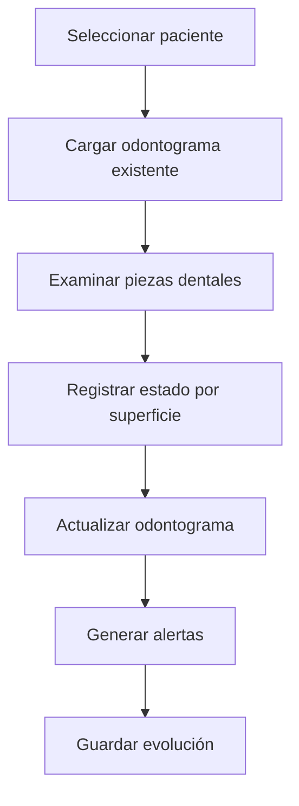
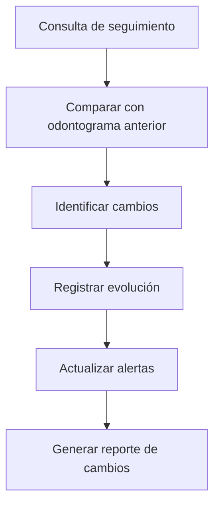

# 🦷 Odontograma 2D/3D
*Exportado el 2025-10-22 21:34:56*
---

> **Nota:** Documentación del módulo de odontograma 2D/3D por pieza/superficie con evolución y alertas para seguimiento dental completo.

# 🎯 Objetivo

Proporcionar una representación visual completa del estado dental del paciente mediante odontogramas 2D y 3D, con seguimiento de evolución y sistema de alertas para tratamientos pendientes.

# 🔄 Diagramas de Flujo de Odontograma

## 📊 Flujo de Creación de Odontograma



## 🔍 Flujo de Evolución Dental



# 📊 Matrices de Piezas Dentales

<!-- Bloque no procesado: table -->

# ⚙️ Configuraciones de Superficies

- Códigos de colores por estado dental
- Simbología estándar FDI
- Plantillas por tipo de pieza
- Alertas automáticas por patología
- Exportación a formatos estándar
# 🧩 Componentes React

- Odontograma2D: representación 2D interactiva
- Odontograma3D: visualización 3D inmersiva
- PiezasDentales: gestión de piezas individuales
- SuperficiesDentales: edición por superficie
- EvolucionOdontograma: seguimiento temporal
- AlertasOdontograma: notificaciones automáticas
# 🔌 APIs Requeridas

```bash
GET /api/odontograma/:pacienteId
POST /api/odontograma/registro
PUT /api/odontograma/:id
GET /api/odontograma/evolucion/:pacienteId
GET /api/odontograma/alertas/:pacienteId
```

# 🗂️ Estructura MERN

```bash
historia-clinica/odontograma/
├─ page.tsx
├─ api/
│  ├─ odontograma-paciente.ts
│  ├─ odontograma-registro.ts
│  ├─ odontograma-actualizar.ts
│  ├─ odontograma-evolucion.ts
│  └─ odontograma-alertas.ts
└─ components/
   ├─ Odontograma2D.tsx
   ├─ Odontograma3D.tsx
   ├─ PiezasDentales.tsx
   ├─ SuperficiesDentales.tsx
   ├─ EvolucionOdontograma.tsx
   └─ AlertasOdontograma.tsx
```

# 📋 Documentación de Procesos

1. Examen inicial y registro de estado dental
1. Actualización por superficie dental
1. Seguimiento de evolución temporal
1. Generación de alertas automáticas
1. Exportación de reportes dentales
> **Nota:** Esta página documenta el módulo. El odontograma debe seguir estándares internacionales FDI y cumplir con normativas de documentación clínica.

