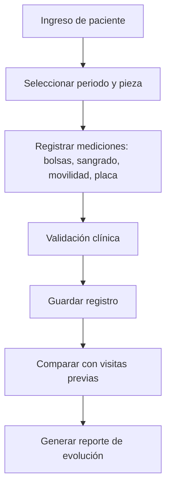

# 🦷 Periodontograma
*Exportado el 2025-10-22 21:35:06*
---

# 🦷 Periodontograma (ERP Dental)

Documentación del módulo de periodontograma con bolsas, sangrado, movilidad, placa y comparativas.

## 📊 Diagrama de Flujo de Periodontograma



## 📋 Matriz de Bolsas Periodontales

<!-- Bloque no procesado: table -->

## ⚙️ Configuraciones de Sangrado y Parámetros

- Escala de sangrado: 0-3 (0: no, 1: leve, 2: moderado, 3: severo)
- Movilidad dental: Miller I-III
- Placa bacteriana: índice simplificado por cuadrante
## 🧩 Componentes React (MERN)

```typescript
// PeriodontogramaViewer.tsx
export function PeriodontogramaViewer() { /* ... */ }
// BolsasPeriodontales.tsx
export function BolsasPeriodontales() { /* ... */ }
// SangradoGingival.tsx
export function SangradoGingival() { /* ... */ }
// MovilidadDental.tsx
export function MovilidadDental() { /* ... */ }
// PlacaBacteriana.tsx
export function PlacaBacteriana() { /* ... */ }
// ComparativasPeriodontales.tsx
export function ComparativasPeriodontales() { /* ... */ }
```

## 🌐 APIs Requeridas

```json
{
  "GET /api/periodontograma/:pacienteId": "Obtener datos actuales",
  "POST /api/periodontograma/registro": "Registrar mediciones",
  "PUT /api/periodontograma/:id": "Actualizar registro",
  "GET /api/periodontograma/comparativas/:pacienteId": "Comparaciones históricas",
  "GET /api/periodontograma/evolucion/:pacienteId": "Serie temporal de evolución"
}
```

## 📁 Estructura de Carpetas (MERN)

```bash
historia-clinica/
  periodontograma/
    page.tsx
    api/
      get-periodontograma.ts
      post-registro.ts
      put-periodontograma.ts
      get-comparativas.ts
      get-evolucion.ts
    components/
      PeriodontogramaViewer.tsx
      BolsasPeriodontales.tsx
      SangradoGingival.tsx
      MovilidadDental.tsx
      PlacaBacteriana.tsx
      ComparativasPeriodontales.tsx
```

## ⚙️ Documentación de Procesos

1. Configuración de parámetros y escalas clínicas
1. Registro de mediciones por pieza y sitio
1. Validación y guardado
1. Comparativas y evolución clínica
> **Nota:** Documentación del módulo de periodontograma. No se crean subpáginas automáticamente.

