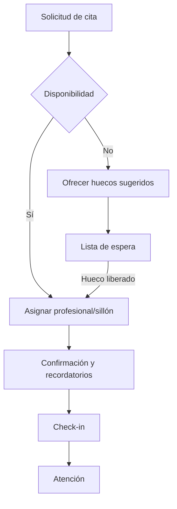
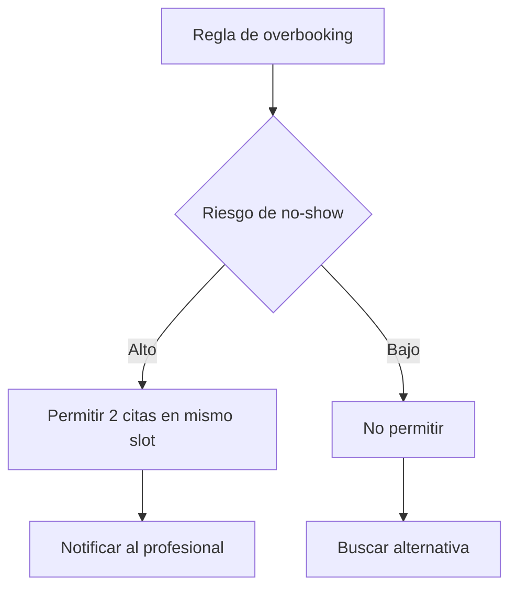

# 🧠 Agenda Inteligente
*Exportado el 2025-10-22 21:34:41*
---

> **Nota:** Documentación del módulo de Agenda Inteligente por profesional/sillón/centro con listas de espera, overbooking controlado y huecos sugeridos.

# 🎯 Objetivo

Optimizar la ocupación de recursos (profesionales y sillones), reducir no‑shows, agilizar la programación y mejorar la experiencia del paciente.

# 🔄 Diagramas de Flujo de Agenda

## 📆 Flujo de Programación



## 📈 Flujo de Overbooking Controlado



# 📊 Matrices de Recursos

## 👨‍⚕️ Matriz de Profesionales

<!-- Bloque no procesado: table -->

## 🪑 Matriz de Sillones

<!-- Bloque no procesado: table -->

# ⚙️ Configuraciones de Centros

- Horarios de apertura por centro
- Calendarios de festivos
- Duración estándar por procedimiento
# 🧩 Componentes React

- AgendaCalendar: Calendario semanal/diario con drag & drop
- ProfesionalSelector: Filtro y asignación de profesional
- SillonManager: Gestión de sillones y estados
- ListaEspera: Priorización y asignación automática
- OverbookingControl: Reglas basadas en riesgo de no-show
- HuecosSugeridos: Motor de recomendación de huecos
# 🔌 APIs Requeridas

```bash
GET /api/agenda/profesionales
GET /api/agenda/sillones
POST /api/agenda/citas
PUT /api/agenda/citas/:id
DELETE /api/agenda/citas/:id
GET /api/agenda/lista-espera
GET /api/agenda/huecos-sugeridos
```

# 🗂️ Estructura MERN

```bash
operacion-diaria/agenda-inteligente/
├─ page.tsx
├─ api/
│  ├─ profesionales.ts
│  ├─ sillones.ts
│  ├─ citas.ts
│  ├─ lista-espera.ts
│  └─ huecos-sugeridos.ts
└─ components/
   ├─ AgendaCalendar.tsx
   ├─ ProfesionalSelector.tsx
   ├─ SillonManager.tsx
   ├─ ListaEspera.tsx
   ├─ OverbookingControl.tsx
   └─ HuecosSugeridos.tsx
```

# 📋 Documentación de Procesos

1. Captura de solicitud de cita
1. Evaluación de reglas de agenda
1. Asignación de profesional y sillón
1. Confirmación y recordatorios
1. Gestión de lista de espera y huecos sugeridos
> **Nota:** Esta página documenta el módulo. Las implementaciones concretas pueden variar por clínica/centro.

