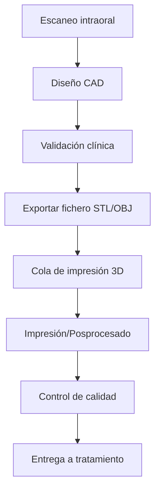

# CAD/CAM & Impresión 3D
*Exportado el 2025-10-23 00:12:19*
---

# 🖨️ CAD/CAM & Impresión 3D

Documentación del módulo CAD/CAM & impresión 3D con ficheros y colas.

## 🔄 Diagrama de flujo CAD/CAM



## 📊 Matrices de Ficheros

<!-- Bloque no procesado: table -->

## ⚙️ Configuraciones de Colas

- Prioridades: urgente, estándar, diferido
- Capacidad de impresoras y tiempos estimados
- Reintentos, cancelaciones y reasignación
## 🧩 Componentes React

- CADCAMManager
- Impresion3D
- FicherosCAD
- ColasImpresion
- DisenoDigital
## 🛠️ APIs requeridas

```bash
GET /api/cadcam/ficheros
POST /api/cadcam/subir
GET /api/cadcam/colas
POST /api/cadcam/impresion
GET /api/cadcam/estado
```

## 📁 Estructura MERN

```bash
laboratorio-protesis/
  cadcam-impresion3d/
    page.tsx
    api/
      ficheros.get.ts
      subir.post.ts
      colas.get.ts
      impresion.post.ts
      estado.get.ts
    components/
      CADCAMManager.tsx
      Impresion3D.tsx
      FicherosCAD.tsx
      ColasImpresion.tsx
      DisenoDigital.tsx
```

## 📋 Procesos de la sección

1. Recepción de escaneos y diseño
1. Export y validación de ficheros
1. Planificación y ejecución de impresión
1. Posprocesado, control y entrega
