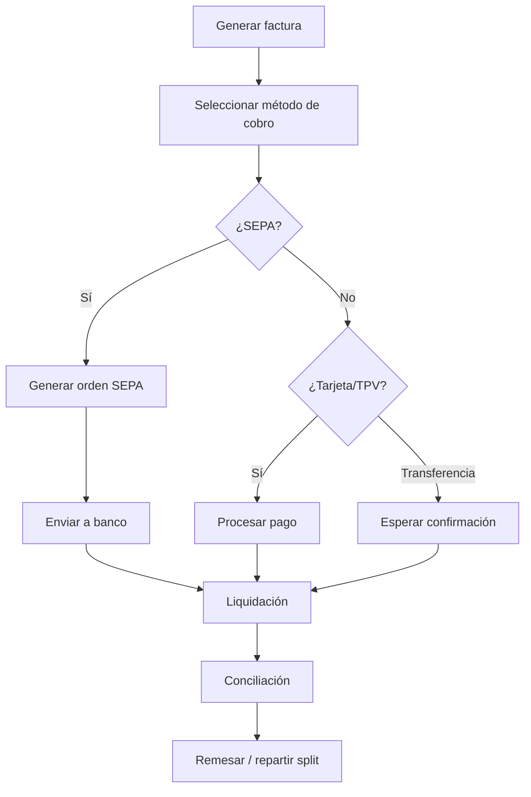

# Cobros & Remesas
*Exportado el 2025-10-23 00:12:04*
---

# 💳 Cobros & Remesas

Documentación del módulo de cobros & remesas con SEPA, domiciliaciones y split de pagos.

## 🔄 Diagramas de flujo de Cobros



## 📊 Matrices SEPA

<!-- Bloque no procesado: table -->

## 🏦 Configuraciones de Domiciliaciones

- Mandatos: referencia única, fechas de firma y caducidad
- Frecuencias: único, recurrente, variable
- Validaciones: IBAN, BIC, límites de importe
## 🧩 Componentes React

- CobrosManager
- SEPAManager
- DomiciliacionesManager
- SplitPagos
- RemesasManager
## 🛠️ APIs requeridas

```bash
GET /api/cobros/lista
POST /api/cobros/sepa
GET /api/cobros/domiciliaciones
POST /api/cobros/split
GET /api/cobros/remesas
```

## 📁 Estructura MERN

```bash
facturacion-seguros/
  cobros-remesas/
    page.tsx
    api/
      lista.ts
      sepa.ts
      domiciliaciones.ts
      split.ts
      remesas.ts
    components/
      CobrosManager.tsx
      SEPAManager.tsx
      DomiciliacionesManager.tsx
      SplitPagos.tsx
      RemesasManager.tsx
```

## 📋 Procesos de la sección

1. Generación de remesas SEPA
1. Registro de domiciliaciones y mandatos
1. Split de pagos por centros o profesionales
1. Conciliación bancaria y reversos
