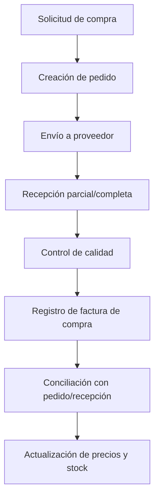

# Compras & Proveedores
*Exportado el 2025-10-23 00:12:10*
---

# 🧾 Compras & Proveedores

Documentación del módulo de compras & proveedores con pedidos, recepciones, facturas y precios.

## 🔄 Diagrama de flujo de Compras



## 📊 Matrices de Proveedores

<!-- Bloque no procesado: table -->

## ⚙️ Configuraciones de Pedidos

- Estados: borrador, enviado, confirmado, recibido, cancelado
- Recepciones parciales y diferencias
- Condiciones: mínimos, descuentos, portes
## 🧩 Componentes React

- ComprasManager
- ProveedoresManager
- PedidosManager
- RecepcionesManager
- FacturasCompras
## 🛠️ APIs requeridas

```bash
GET /api/compras/lista
POST /api/compras/pedido
GET /api/compras/proveedores
POST /api/compras/recepcion
GET /api/compras/facturas
```

## 📁 Estructura MERN

```bash
inventario-compras/
  compras-proveedores/
    page.tsx
    api/
      lista.ts
      pedido.ts
      proveedores.ts
      recepcion.ts
      facturas.ts
    components/
      ComprasManager.tsx
      ProveedoresManager.tsx
      PedidosManager.tsx
      RecepcionesManager.tsx
      FacturasCompras.tsx
```

## 📋 Procesos de la sección

1. Solicitud y aprobación de compras
1. Creación de pedidos y envío a proveedor
1. Recepciones, control de calidad y diferencias
1. Registro de facturas de compra y conciliación
