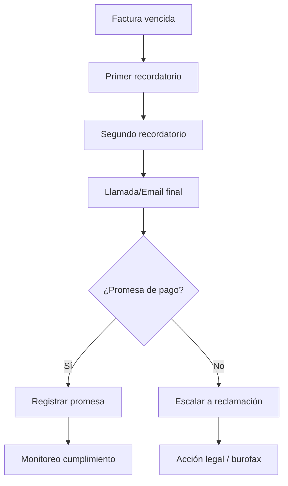

# Deuda & Reclamaciones
*Exportado el 2025-10-23 00:12:06*
---

# 📊 Deuda & Reclamaciones

Documentación del módulo de deuda & reclamaciones con dunning y promesas de pago.

## 🔄 Diagrama de flujo de Deuda



## 📋 Matrices de Reclamaciones

<!-- Bloque no procesado: table -->

## ⚙️ Configuraciones de Dunning

- Reglas por antigüedad y riesgo
- Plantillas por canal (email/SMS/llamada)
- Escalado automático y excepciones
## 🧩 Componentes React

- DeudaManager
- ReclamacionesManager
- DunningManager
- PromesasPago
- SeguimientoDeuda
## 🛠️ APIs requeridas

```bash
GET /api/deuda/lista
POST /api/deuda/reclamar
GET /api/deuda/dunning
POST /api/deuda/promesa
GET /api/deuda/seguimiento
```

## 📁 Estructura MERN

```bash
facturacion-seguros/
  deuda-reclamaciones/
    page.tsx
    api/
      lista.ts
      reclamar.ts
      dunning.ts
      promesa.ts
      seguimiento.ts
    components/
      DeudaManager.tsx
      ReclamacionesManager.tsx
      DunningManager.tsx
      PromesasPago.tsx
      SeguimientoDeuda.tsx
```

## 📋 Procesos de la sección

1. Clasificación de deuda (edad/importe/riesgo)
1. Ejecución de dunning multicanal
1. Registro y seguimiento de promesas
1. Escalado a reclamación y cierre
