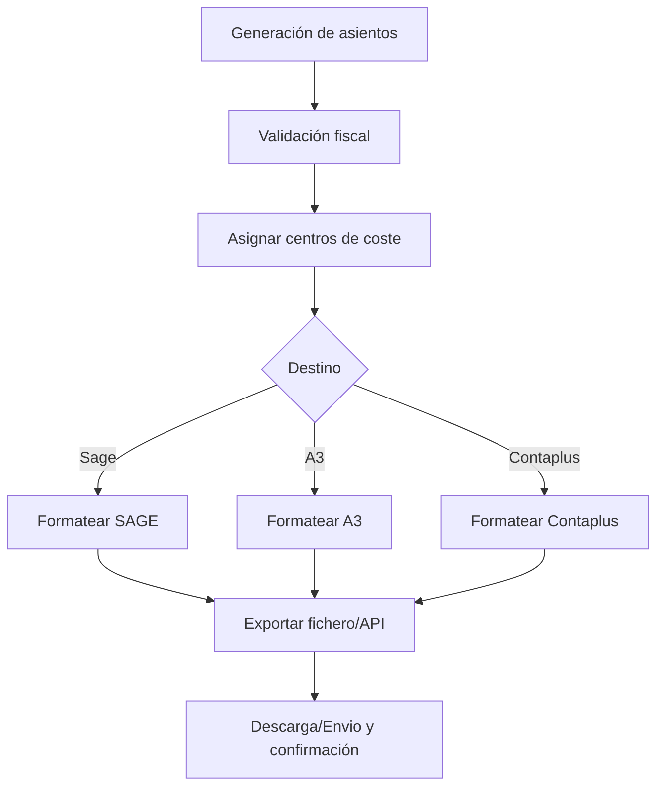

# Export Contable
*Exportado el 2025-10-23 00:12:08*
---

# 📤 Export Contable

Documentación del módulo de export contable con Sage, A3, Contaplus y centros de coste.

## 🔄 Diagrama de flujo de Export Contable



## 📊 Matrices de Centros de Coste

<!-- Bloque no procesado: table -->

## 🔌 Configuraciones de Integraciones Contables

- Mapeos de cuentas y subcuentas
- Formato de export (CSV/XML/JSON/API)
- Periodos y cierres contables
## 🧩 Componentes React

- ExportContable
- SageIntegration
- A3Integration
- ContaplusIntegration
- CentrosCoste
## 🛠️ APIs requeridas

```bash
GET /api/contable/export
POST /api/contable/sage
GET /api/contable/a3
POST /api/contable/contaplus
GET /api/contable/centros-coste
```

## 📁 Estructura MERN

```bash
facturacion-seguros/
  export-contable/
    page.tsx
    api/
      export.ts
      sage.ts
      a3.ts
      contaplus.ts
      centros-coste.ts
    components/
      ExportContable.tsx
      SageIntegration.tsx
      A3Integration.tsx
      ContaplusIntegration.tsx
      CentrosCoste.tsx
```

## 📋 Procesos de la sección

1. Generación de asientos y validaciones
1. Asignación por centros de coste
1. Export según destino (Sage/A3/Contaplus)
1. Conciliación y auditoría
