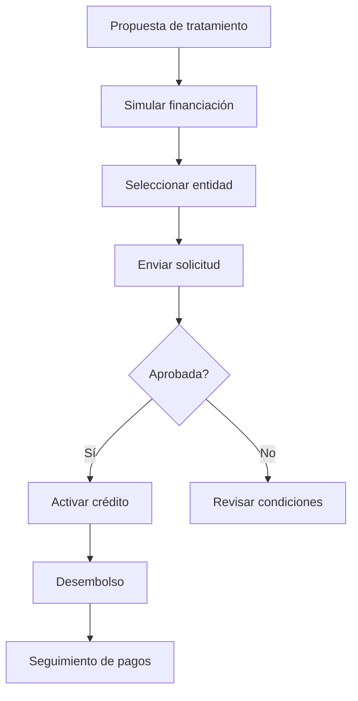

# Financiación al Paciente
*Exportado el 2025-10-23 00:12:05*
---

# 🏦 Financiación al Paciente

Documentación completa del módulo de financiación al paciente con integraciones con financieras.

## 🔄 Diagramas de flujo de Financiación



## 📊 Matrices de Financieras

<!-- Bloque no procesado: table -->

## 🔌 Configuraciones de Integraciones

- Claves API por entidad financiera
- Callbacks/WEBHOOK de estado de solicitud
- Validaciones KYC/AML si aplica
## 🧩 Componentes React

- FinanciacionManager
- IntegracionesFinancieras
- CalculadoraFinanciacion
- AprobacionFinanciacion
- SeguimientoFinanciacion
## 🛠️ APIs requeridas

```bash
GET /api/financiacion/opciones
POST /api/financiacion/solicitar
GET /api/financiacion/estado
POST /api/financiacion/aprobar
GET /api/financiacion/integraciones
```

## 📁 Estructura MERN

```bash
facturacion-seguros/
  financiacion-paciente/
    page.tsx
    api/
      opciones.ts
      solicitar.ts
      estado.ts
      aprobar.ts
      integraciones.ts
    components/
      FinanciacionManager.tsx
      IntegracionesFinancieras.tsx
      CalculadoraFinanciacion.tsx
      AprobacionFinanciacion.tsx
      SeguimientoFinanciacion.tsx
```

## 📋 Procesos de la sección

1. Simulación y selección de oferta
1. Solicitud y evaluación automática
1. Aprobación/denegación y notificaciones
1. Desembolso y seguimiento de pagos
