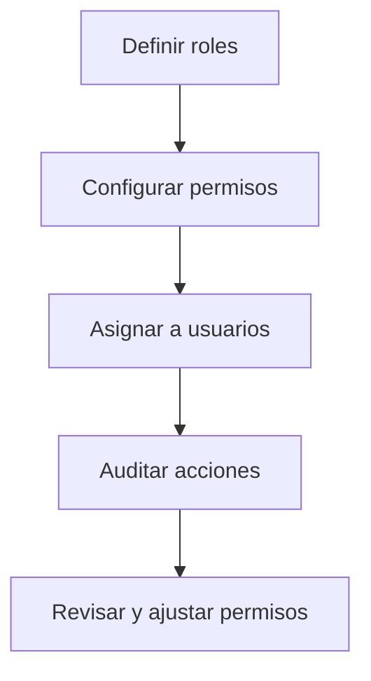

# Gestión de Roles Facturación
*Exportado el 2025-10-23 00:12:09*
---

# 👥 Gestión de Roles Facturación

Documentación del módulo de gestión de roles para Administración, Finanzas y Gerencia.

## 🔄 Diagrama de flujo de roles



## 📊 Matriz de permisos por función

<!-- Bloque no procesado: table -->

## 🔐 Configuraciones de accesos

- Políticas por área de facturación (facturas, cobros, seguros, export)
- Controles de aprobación y segregación de funciones
- Auditoría y registros de actividad
## 🧩 Componentes React

- RolesFacturacionManager
- PermisosAdministracion
- PermisosFinanzas
- PermisosGerencia
- AccesosFacturacion
## 🛠️ APIs requeridas

```bash
GET /api/facturacion/roles
POST /api/facturacion/roles
GET /api/facturacion/permisos
POST /api/facturacion/permisos/asignar
GET /api/facturacion/auditoria
```

## 📁 Estructura MERN

```bash
facturacion-seguros/
  gestion-roles-facturacion/
    page.tsx
    api/
      roles.get.ts
      roles.post.ts
      permisos.get.ts
      permisos-asignar.post.ts
      auditoria.get.ts
    components/
      RolesFacturacionManager.tsx
      PermisosAdministracion.tsx
      PermisosFinanzas.tsx
      PermisosGerencia.tsx
      AccesosFacturacion.tsx
```

## 📋 Procesos de la sección

1. Alta de roles y definición de permisos
1. Asignación a usuarios/áreas
1. Auditoría y revisiones periódicas
