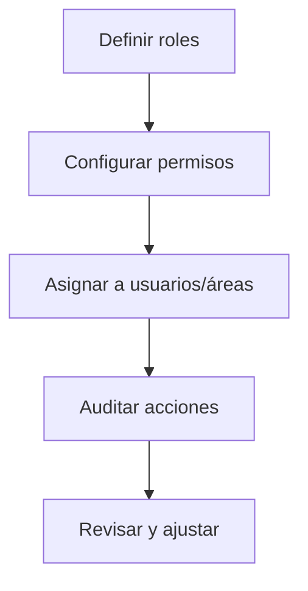

# Gestión de Roles Inventario
*Exportado el 2025-10-23 00:12:16*
---

# 👥 Gestión de Roles Inventario

Documentación de roles para Esterilización, Auxiliares, Administración y Calidad.

## 🔄 Diagrama de flujo de roles inventario



## 📊 Matriz de permisos por función

<!-- Bloque no procesado: table -->

## 🔐 Configuraciones de accesos

- Áreas: esterilización, almacén, clínica, compras
- Segregación y aprobación de cambios de stock
- Auditoría continua y reportes
## 🧩 Componentes React

- RolesInventarioManager
- PermisosEsterilizacion
- PermisosAuxiliares
- PermisosAdministracion
- PermisosCalidad
## 🛠️ APIs requeridas

```bash
GET /api/inventario/roles
POST /api/inventario/roles
GET /api/inventario/permisos
POST /api/inventario/permisos/asignar
GET /api/inventario/auditoria
```

## 📁 Estructura MERN

```bash
inventario-compras/
  gestion-roles-inventario/
    page.tsx
    api/
      roles.get.ts
      roles.post.ts
      permisos.get.ts
      permisos-asignar.post.ts
      auditoria.get.ts
    components/
      RolesInventarioManager.tsx
      PermisosEsterilizacion.tsx
      PermisosAuxiliares.tsx
      PermisosAdministracion.tsx
      PermisosCalidad.tsx
```

## 📋 Procesos de la sección

1. Alta de roles y definición de permisos
1. Asignación por áreas y equipos
1. Auditoría y revisiones periódicas
