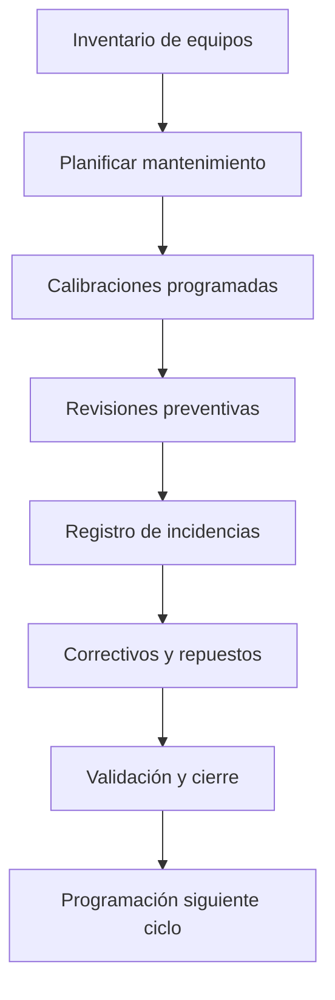

# Mantenimiento de Equipos
*Exportado el 2025-10-23 00:12:15*
---

# 🛠️ Mantenimiento de Equipos

Documentación del módulo con calibraciones, incidencias y revisiones.

## 🔄 Diagrama de flujo de Mantenimiento



## 📊 Matrices de Equipos

<!-- Bloque no procesado: table -->

## ⚙️ Configuraciones de Calibraciones

- Patrones y certificados por equipo
- Tolerancias y criterios de aceptación
- Calendarios y recordatorios
## 🧩 Componentes React

- MantenimientoEquipos
- CalibracionesManager
- IncidenciasEquipos
- RevisionesEquipos
- ProgramacionMantenimiento
## 🛠️ APIs requeridas

```bash
GET /api/mantenimiento/equipos
POST /api/mantenimiento/calibracion
GET /api/mantenimiento/incidencias
POST /api/mantenimiento/revision
GET /api/mantenimiento/programacion
```

## 📁 Estructura MERN

```bash
inventario-compras/
  mantenimiento-equipos/
    page.tsx
    api/
      equipos.ts
      calibracion.ts
      incidencias.ts
      revision.ts
      programacion.ts
    components/
      MantenimientoEquipos.tsx
      CalibracionesManager.tsx
      IncidenciasEquipos.tsx
      RevisionesEquipos.tsx
      ProgramacionMantenimiento.tsx
```

## 📋 Procesos de la sección

1. Inventario y criticidad de equipos
1. Planificación (calibraciones / preventivos)
1. Gestión de incidencias y correctivos
1. Cierre, evidencias y seguimiento
