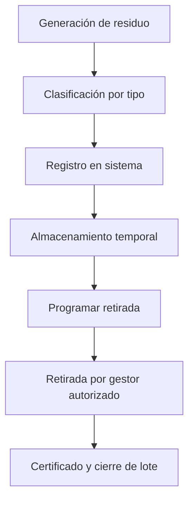

# Residuos Sanitarios
*Exportado el 2025-10-23 00:12:13*
---

# 🗑️ Residuos Sanitarios

Documentación del módulo de residuos sanitarios con registro y retirada.

## 🔄 Diagrama de flujo de Residuos



## 📊 Matrices de Registro

<!-- Bloque no procesado: table -->

## ⚙️ Configuraciones de Retirada

- Programaciones por tipo y volumen
- Documentación de retirada y certificados
- Trazabilidad por lote y gestor
## 🧩 Componentes React

- ResiduosManager
- RegistroResiduos
- RetiradaResiduos
- ClasificacionResiduos
- SeguimientoResiduos
## 🛠️ APIs requeridas

```bash
GET /api/residuos/lista
POST /api/residuos/registrar
GET /api/residuos/retirada
POST /api/residuos/clasificar
GET /api/residuos/seguimiento
```

## 📁 Estructura MERN

```bash
inventario-compras/
  residuos-sanitarios/
    page.tsx
    api/
      lista.ts
      registrar.ts
      retirada.ts
      clasificar.ts
      seguimiento.ts
    components/
      ResiduosManager.tsx
      RegistroResiduos.tsx
      RetiradaResiduos.tsx
      ClasificacionResiduos.tsx
      SeguimientoResiduos.tsx
```

## 📋 Procesos de la sección

1. Clasificación y registro de residuos
1. Programación y ejecución de retiradas
1. Certificación y trazabilidad
