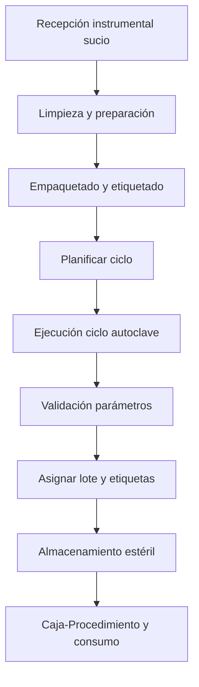

# Trazabilidad de Material Estéril
*Exportado el 2025-10-23 00:12:12*
---

# 🧼 Trazabilidad de Material Estéril

Documentación del módulo de trazabilidad con ciclos, lotes, etiquetas y caja-procedimiento.

## 🔄 Diagrama de flujo de Esterilización



## 📊 Matrices de Ciclos

<!-- Bloque no procesado: table -->

## ⚙️ Configuraciones de Lotes

- Generación de lote por ciclo con UID
- Trazabilidad: ciclo → lote → etiqueta → caja → paciente
- Controles: indicadores químicos/físicos, liberación de carga
## 🧩 Componentes React

- TrazabilidadEsteril
- CiclosEsteril
- LotesEsteril
- EtiquetasEsteril
- CajaProcedimiento
## 🛠️ APIs requeridas

```bash
GET /api/esterilizacion/ciclos
POST /api/esterilizacion/registrar
GET /api/esterilizacion/lotes
POST /api/esterilizacion/etiquetas
GET /api/esterilizacion/trazabilidad
```

## 📁 Estructura MERN

```bash
inventario-compras/
  trazabilidad-esteril/
    page.tsx
    api/
      ciclos.ts
      registrar.ts
      lotes.ts
      etiquetas.ts
      trazabilidad.ts
    components/
      TrazabilidadEsteril.tsx
      CiclosEsteril.tsx
      LotesEsteril.tsx
      EtiquetasEsteril.tsx
      CajaProcedimiento.tsx
```

## 📋 Procesos de la sección

1. Preparación, empaquetado y planificación
1. Ejecución de ciclo y validación
1. Etiquetado, almacenamiento y asignación a caja
1. Consumo en procedimiento y trazabilidad a paciente
