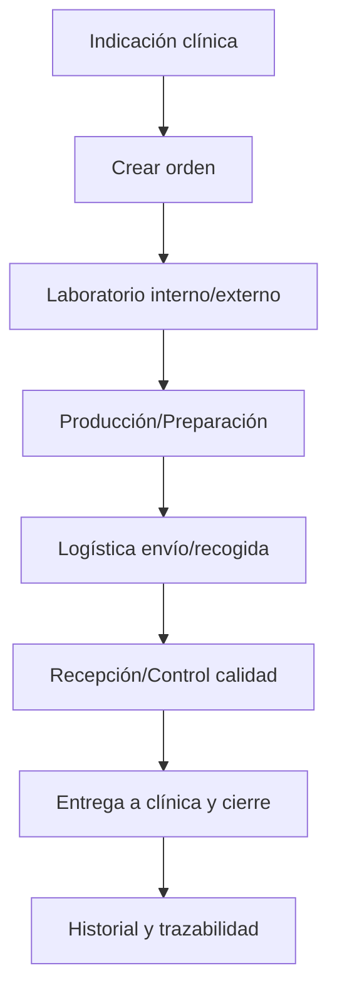

# Órdenes a Laboratorio
*Exportado el 2025-10-23 00:12:17*
---

# 🧪 Órdenes a Laboratorio

Documentación del módulo de órdenes a laboratorio interno/externo con estados y logística.

## 🔄 Diagrama de flujo de Laboratorio



## 📊 Matrices de Órdenes

<!-- Bloque no procesado: table -->

## ⚙️ Configuraciones de Estados

- Borrador, Enviado, En Producción, En Logística, Recibido, Entregado, Cerrado
- Transiciones permitidas y validaciones
- SLA por tipo de orden
## 🧩 Componentes React

- OrdenesLaboratorio
- LaboratorioInterno
- LaboratorioExterno
- EstadosOrdenes
- LogisticaLaboratorio
## 🛠️ APIs requeridas

```bash
GET /api/laboratorio/ordenes
POST /api/laboratorio/orden
GET /api/laboratorio/estados
POST /api/laboratorio/logistica
GET /api/laboratorio/historial
```

## 📁 Estructura MERN

```bash
laboratorio-protesis/
  ordenes-laboratorio/
    page.tsx
    api/
      ordenes.get.ts
      orden.post.ts
      estados.get.ts
      logistica.post.ts
      historial.get.ts
    components/
      OrdenesLaboratorio.tsx
      LaboratorioInterno.tsx
      LaboratorioExterno.tsx
      EstadosOrdenes.tsx
      LogisticaLaboratorio.tsx
```

## 📋 Procesos de la sección

1. Creación de orden y selección de laboratorio
1. Producción y control de calidad
1. Logística, recepción y entrega
1. Cierre y trazabilidad
