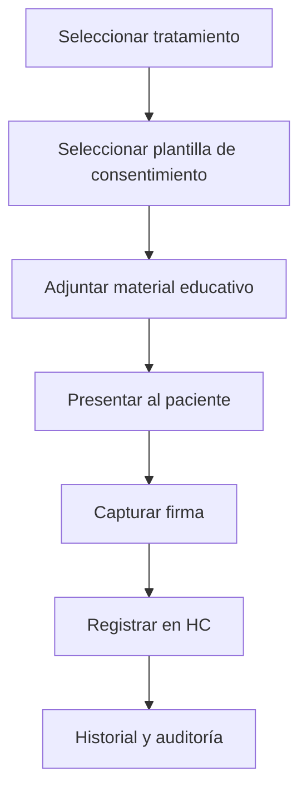

# ✍️ Consentimientos por Tratamiento
*Exportado el 2025-10-23 00:12:00*
---

# ✍️ Consentimientos por Tratamiento (ERP Dental)

Documentación del módulo de gestión de consentimientos específicos por tratamiento y material educativo asociado.

## 🔁 Flujo de Consentimientos



## 📋 Matriz de Tratamientos

<!-- Bloque no procesado: table -->

## ⚙️ Configuraciones de Material Educativo

- Vinculación de PDFs, vídeos y guías
- Versionado y trazabilidad de contenido
- Idiomas y accesibilidad
## 🧩 Componentes React (MERN)

```typescript
// ConsentimientosTratamiento.tsx
export function ConsentimientosTratamiento() { /* ... */ }
// MaterialEducativo.tsx
export function MaterialEducativo() { /* ... */ }
// ConsentimientosEspecificos.tsx
export function ConsentimientosEspecificos() { /* ... */ }
// FirmaConsentimientos.tsx
export function FirmaConsentimientos() { /* ... */ }
// GestionConsentimientos.tsx
export function GestionConsentimientos() { /* ... */ }
```

## 🌐 APIs Requeridas

```json
{
  "GET /api/consentimientos/:tratamientoId": "Obtener plantillas y requisitos",
  "POST /api/consentimientos/crear": "Crear/actualizar consentimiento",
  "GET /api/consentimientos/material/:id": "Obtener material educativo",
  "POST /api/consentimientos/firmar": "Firmar electrónicamente",
  "GET /api/consentimientos/historial/:pacienteId": "Historial de consentimientos"
}
```

## 📁 Estructura de Carpetas (MERN)

```bash
planes-tratamiento/
  consentimientos-tratamiento/
    page.tsx
    api/
      get-consentimientos.ts
      post-crear.ts
      get-material.ts
      post-firmar.ts
      get-historial.ts
    components/
      ConsentimientosTratamiento.tsx
      MaterialEducativo.tsx
      ConsentimientosEspecificos.tsx
      FirmaConsentimientos.tsx
      GestionConsentimientos.tsx
```

## ⚙️ Documentación de Procesos

1. Selección de tratamiento y plantilla
1. Presentación de material educativo
1. Firma electrónica y registro
> **Nota:** Documentación del módulo de Consentimientos por Tratamiento.

