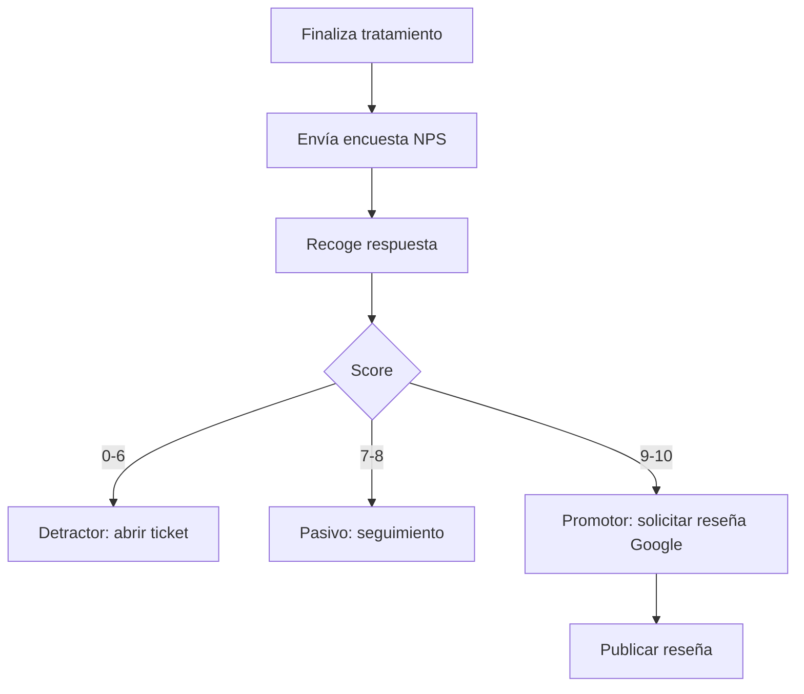

# ⭐ NPS & Reseñas
*Exportado el 2025-10-23 00:12:28*
---

> **Nota:** Documentación del módulo de NPS y reseñas: encuestas, reseñas de Google y reputación.

# 🎯 Objetivo

Medir la satisfacción del paciente, potenciar reseñas positivas y gestionar reputación.

# 🔄 Diagramas de Flujo de NPS



# 📊 Matrices de Reseñas

<!-- Bloque no procesado: table -->

# 📝 Configuraciones de Cuestionarios

- Plantillas NPS (0-10)
- Disparadores por etapa de tratamiento
- Ramas condicionales para promotores/detractores
# 🧩 Componentes React

- NPSManager: orquestación de encuestas y resultados
- ReseasManager: gestión de reseñas y respuestas
- GoogleReseas: integración con Google
- CuestionariosNPS: constructor y plantillas
- ReputacionManager: reputación y alertas
# 🔌 APIs Requeridas

```bash
GET /api/marketing/nps
POST /api/marketing/cuestionario
GET /api/marketing/reseas
POST /api/marketing/google
GET /api/marketing/reputacion
```

# 🗂️ Estructura MERN

```bash
marketing-ventas/nps-reseas/
├─ page.tsx
├─ api/
│  ├─ nps.ts
│  ├─ cuestionario.ts
│  ├─ reseas.ts
│  └─ reputacion.ts
└─ components/
   ├─ NPSManager.tsx
   ├─ ReseasManager.tsx
   ├─ GoogleReseas.tsx
   ├─ CuestionariosNPS.tsx
   └─ ReputacionManager.tsx
```

# 📋 Documentación de Procesos

1. Disparo de encuesta tras evento clínico
1. Recolección y cómputo de NPS
1. Derivación a reseñas externas
1. Gestión de reputación y alertas
> **Nota:** Esta página documenta el módulo. Subpáginas por canal/plataforma podrán añadirse más adelante.

