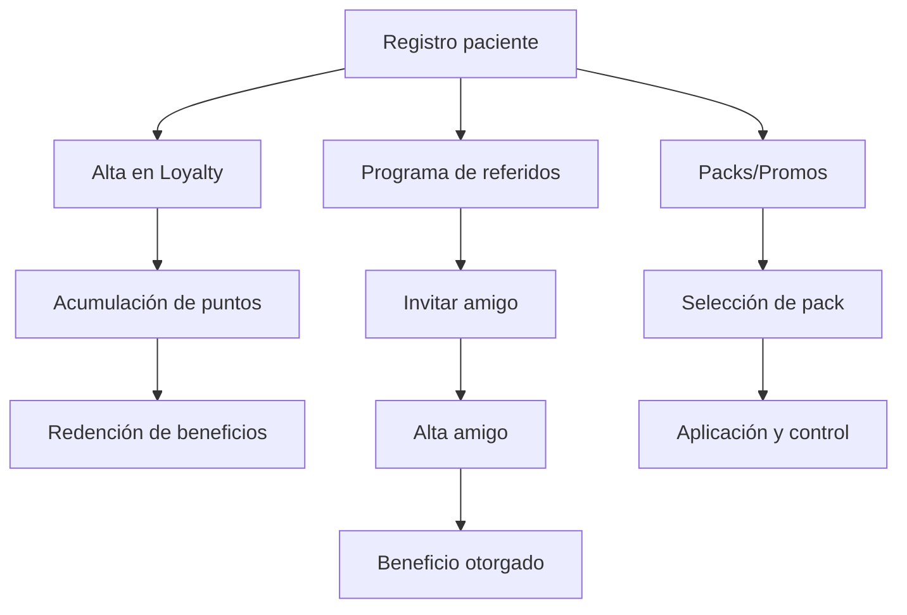

# 🎁 Programas
*Exportado el 2025-10-23 00:12:30*
---

> **Nota:** Documentación del módulo de Programas: loyalty, referidos y packs/promos.

# 🎯 Objetivo

Fidelizar pacientes, incentivar referidos y aumentar el ticket medio mediante packs/promociones.

# 🔄 Diagramas de Flujo de Programas



# 📊 Matrices de Loyalty

<!-- Bloque no procesado: table -->

# 🤝 Configuraciones de Referidos

- Códigos únicos por paciente
- Beneficios para invitador e invitado
- Antifraude y límites
# 🧩 Componentes React

- ProgramasManager: vista general
- LoyaltyManager: niveles, puntos, beneficios
- ReferidosManager: códigos y tracking
- PacksPromos: catálogo y reglas
- BeneficiosManager: redenciones y control
# 🔌 APIs Requeridas

```bash
GET /api/marketing/programas
POST /api/marketing/loyalty
GET /api/marketing/referidos
POST /api/marketing/packs
GET /api/marketing/promos
```

# 🗂️ Estructura MERN

```bash
marketing-ventas/programas/
├─ page.tsx
├─ api/
│  ├─ programas.ts
│  ├─ loyalty.ts
│  ├─ referidos.ts
│  ├─ packs.ts
│  └─ promos.ts
└─ components/
   ├─ ProgramasManager.tsx
   ├─ LoyaltyManager.tsx
   ├─ ReferidosManager.tsx
   ├─ PacksPromos.tsx
   └─ BeneficiosManager.tsx
```

# 📋 Documentación de Procesos

1. Alta y configuración de programa
1. Gestión de niveles y beneficios
1. Ejecución de campañas de referidos
1. Control de packs/promos y redenciones
> **Nota:** Esta página documenta el módulo. Subpáginas por tipo de programa podrán añadirse más adelante.

