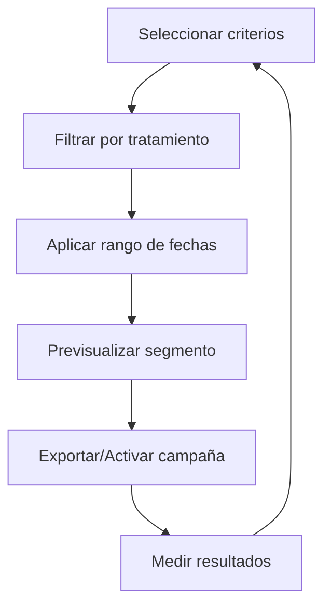

# 🎯 Segmentación por Tratamiento/Fecha
*Exportado el 2025-10-23 00:12:25*
---

> **Nota:** Documentación del módulo de segmentación por tratamiento y fecha para campañas y análisis.

# 🎯 Objetivo

Permitir segmentar pacientes por tratamientos recibidos/pendientes y por ventanas de tiempo para activar campañas y análisis de cohortes.

# 🔄 Diagramas de Flujo de Segmentación

## 🧭 Flujo General



# 📊 Matrices de Tratamientos

<!-- Bloque no procesado: table -->

# 🗓️ Configuraciones de Fechas

- Rango relativo (últimos N días/meses)
- Rango absoluto (desde/hasta)
- Ventanas por evento (alta, diagnóstico, cierre)
# 🧩 Componentes React

- SegmentacionManager: orquestación de criterios y resultados
- TratamientosSegmentacion: selección de tratamientos
- FechasSegmentacion: selección de rangos de fechas
- CriteriosSegmentacion: reglas avanzadas
- AnalisisSegmentacion: métricas y cohortes
# 🔌 APIs Requeridas

```bash
GET /api/marketing/segmentacion
POST /api/marketing/segmentar
GET /api/marketing/tratamientos
POST /api/marketing/criterios
GET /api/marketing/analisis
```

# 🗂️ Estructura MERN

```bash
marketing-ventas/segmentacion-tratamiento-fecha/
├─ page.tsx
├─ api/
│  ├─ segmentacion.ts
│  ├─ tratamientos.ts
│  └─ analisis.ts
└─ components/
   ├─ SegmentacionManager.tsx
   ├─ TratamientosSegmentacion.tsx
   ├─ FechasSegmentacion.tsx
   ├─ CriteriosSegmentacion.tsx
   └─ AnalisisSegmentacion.tsx
```

# 📋 Documentación de Procesos

1. Definición de criterios de segmentación
1. Aplicación de filtros de tratamiento y fecha
1. Validación y muestra del segmento
1. Exportación/Activación de campaña
1. Medición y feedback loop
> **Nota:** Esta página documenta el módulo. Las subpáginas por caso de uso o especialidad podrán añadirse más adelante.

