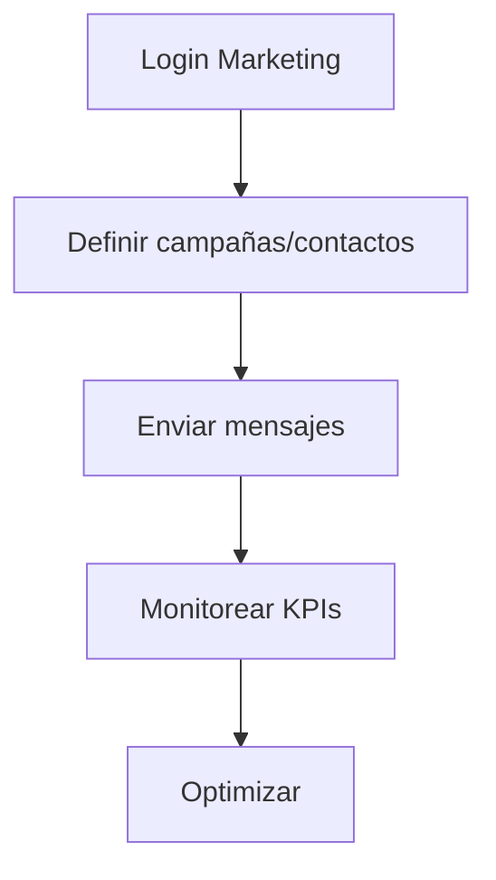
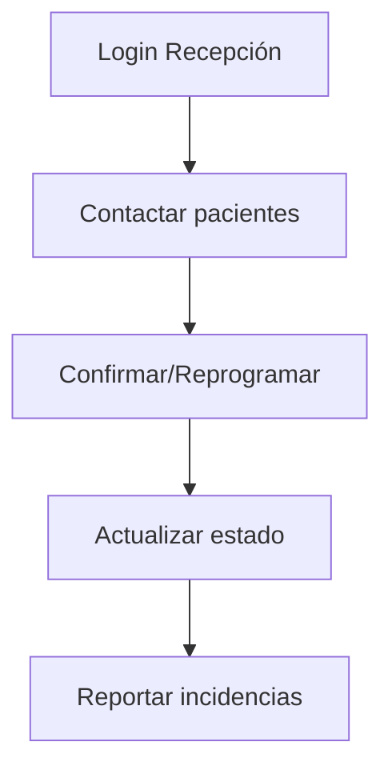
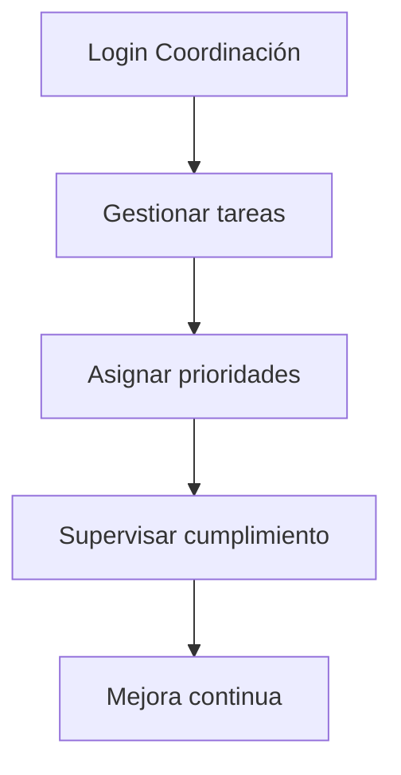

# 👥 Gestión de Roles Comunicación
*Exportado el 2025-10-23 00:12:37*
---

> **Nota:** Documentación del módulo de gestión de roles de comunicación para Marketing, Recepción y Coordinación. Define permisos, accesos, componentes UI y APIs.

# 🎯 Objetivo

Definir gobernanza de permisos y accesos del área de comunicación omnicanal, con seguridad, trazabilidad y eficiencia por función.

# 🔄 Diagramas de Flujo de Roles

## 📣 Flujo Marketing



## 🛎️ Flujo Recepción



## 📅 Flujo Coordinación



# 📊 Matrices de Permisos por Función

<!-- Bloque no procesado: table -->

# 🔐 Configuraciones de Accesos

- Niveles por rol (lectura/edición/aprobación)
- Campos sensibles y confidencialidad
- Controles de sesión y MFA
# 🧩 Componentes React

- RolesComunicacionManager: consola principal
- PermisosMarketing: configuración para Marketing
- PermisosRecepcion: permisos operativos
- PermisosCoordinacion: supervisión y políticas
- AccesosComunicacion: controles granulares
# 🔌 APIs Requeridas

```bash
GET /api/comunicacion/roles
POST /api/comunicacion/roles
GET /api/comunicacion/permisos
POST /api/comunicacion/permisos/asignar
GET /api/comunicacion/auditoria
```

# 🗂️ Estructura MERN

```bash
omnicanal-comunicacion/gestion-roles-comunicacion/
├─ page.tsx
├─ api/
│  ├─ roles.ts
│  ├─ permisos.ts
│  └─ auditoria.ts
└─ components/
   ├─ RolesComunicacionManager.tsx
   ├─ PermisosMarketing.tsx
   ├─ PermisosRecepcion.tsx
   ├─ PermisosCoordinacion.tsx
   └─ AccesosComunicacion.tsx
```

# 📋 Documentación de Procesos

1. Alta y configuración de roles
1. Asignación de permisos por función
1. Revisión y auditoría
1. Mantenimiento de políticas
> **Nota:** Esta página documenta el módulo. Las subpáginas especializadas podrán añadirse más adelante.

