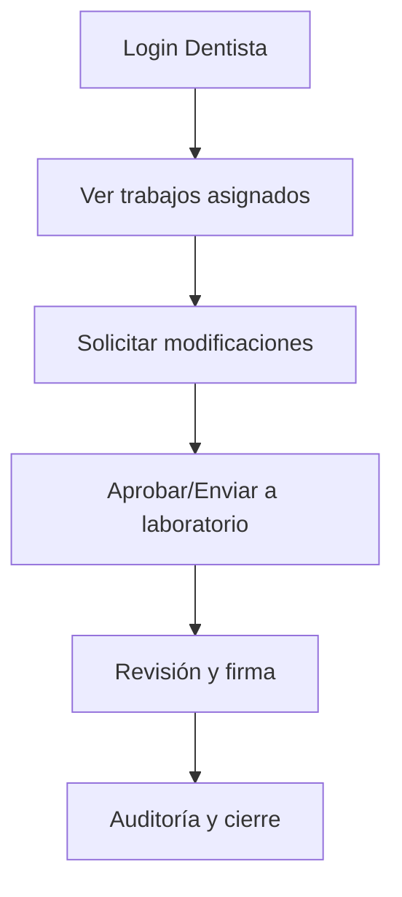
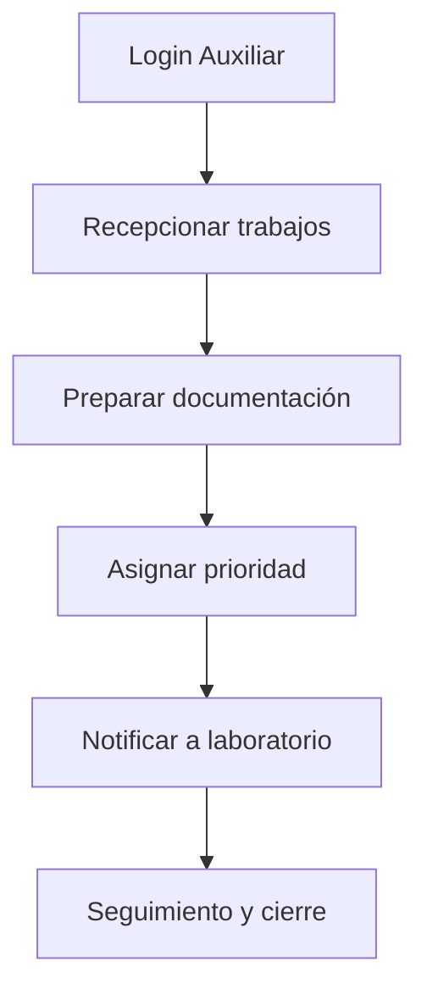
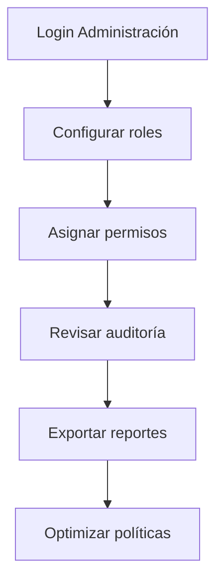

# 👥 Gestión de Roles Laboratorio
*Exportado el 2025-10-23 00:12:20*
---

> **Nota:** Documentación del módulo de gestión de roles de laboratorio para Dentistas, Auxiliares y Administración. Define permisos, accesos, componentes UI y APIs.

# 🎯 Objetivo

Establecer la gobernanza de permisos y accesos del laboratorio protésico dentro del ERP dental, asegurando seguridad, trazabilidad y eficiencia operativa para cada rol.

# 🔄 Diagramas de Flujo de Roles de Laboratorio

## 🧑‍⚕️ Flujo Dentistas



## 🧑‍🔬 Flujo Auxiliares



## 🏢 Flujo Administración



# 📊 Matrices de Permisos por Función

<!-- Bloque no procesado: table -->

# 🔐 Configuraciones de Accesos

- Niveles de acceso por rol (lectura, edición, aprobación)
- Campos sensibles y confidencialidad
- Controles de sesión y MFA
# 🧩 Componentes React

- RolesLaboratorioManager: vista principal de gestión de roles
- PermisosDentistas: permisos específicos para Dentistas
- PermisosAuxiliares: permisos específicos para Auxiliares
- PermisosAdministracion: gestión de políticas y auditoría
- AccesosLaboratorio: configuración de accesos granulares
# 🔌 APIs Requeridas

```bash
GET /api/laboratorio/roles
POST /api/laboratorio/roles
GET /api/laboratorio/permisos
POST /api/laboratorio/permisos/asignar
GET /api/laboratorio/auditoria
```

# 🗂️ Estructura MERN

```bash
laboratorio-protesis/gestion-roles-laboratorio/
├─ page.tsx
├─ api/
│  ├─ roles.ts
│  ├─ permisos.ts
│  └─ auditoria.ts
└─ components/
   ├─ RolesLaboratorioManager.tsx
   ├─ PermisosDentistas.tsx
   ├─ PermisosAuxiliares.tsx
   ├─ PermisosAdministracion.tsx
   └─ AccesosLaboratorio.tsx
```

# 📋 Documentación de Procesos

1. Alta y configuración de roles
1. Asignación de permisos por función
1. Revisión y auditoría de acciones
1. Mantenimiento de políticas y optimización
> **Nota:** Esta página documenta el módulo. Las subpáginas especializadas (p.ej. por laboratorio externo) podrán añadirse más adelante.

