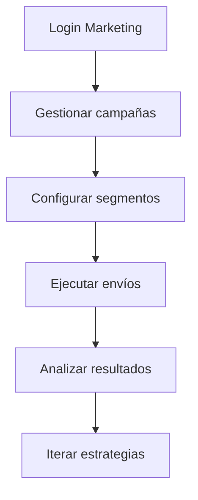
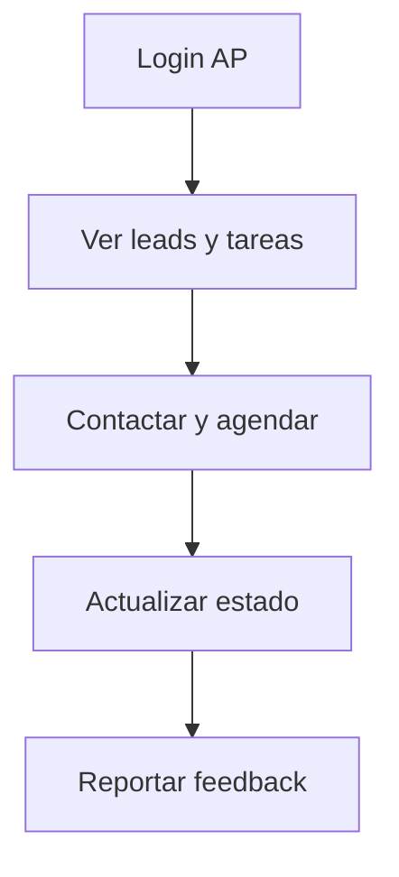
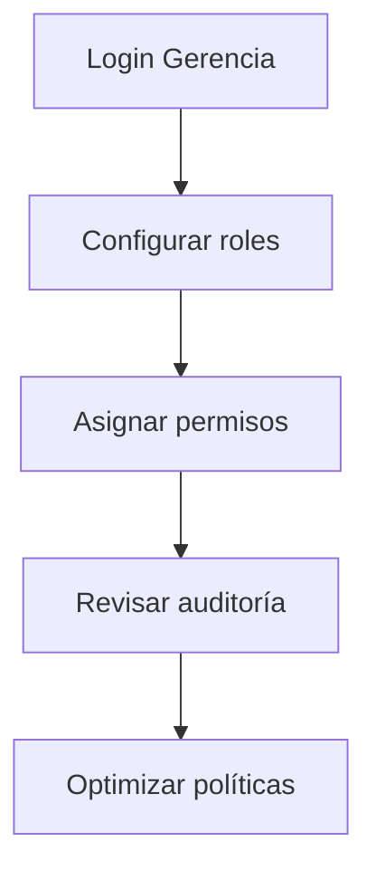

# 👥 Gestión de Roles Marketing
*Exportado el 2025-10-23 00:12:31*
---

> **Nota:** Documentación del módulo de gestión de roles de marketing para Marketing, Atención al Paciente y Gerencia. Define permisos, accesos, componentes UI y APIs.

# 🎯 Objetivo

Establecer gobernanza de permisos y accesos en el dominio de marketing del ERP dental, garantizando seguridad, trazabilidad y eficiencia por función.

# 🔄 Diagramas de Flujo de Roles

## 📣 Flujo Marketing



## 🤝 Flujo Atención Paciente



## 🏢 Flujo Gerencia



# 📊 Matrices de Permisos por Función

<!-- Bloque no procesado: table -->

# 🔐 Configuraciones de Accesos

- Niveles por rol (lectura/edición/aprobación)
- Campos sensibles y confidencialidad
- Controles de sesión y MFA
# 🧩 Componentes React

- RolesMarketingManager: consola principal
- PermisosMarketing: configuración para Marketing
- PermisosAtencionPaciente: permisos y límites operativos
- PermisosGerencia: políticas y auditoría
- AccesosMarketing: controles granulares
# 🔌 APIs Requeridas

```bash
GET /api/marketing/roles
POST /api/marketing/roles
GET /api/marketing/permisos
POST /api/marketing/permisos/asignar
GET /api/marketing/auditoria
```

# 🗂️ Estructura MERN

```bash
marketing-ventas/gestion-roles-marketing/
├─ page.tsx
├─ api/
│  ├─ roles.ts
│  ├─ permisos.ts
│  └─ auditoria.ts
└─ components/
   ├─ RolesMarketingManager.tsx
   ├─ PermisosMarketing.tsx
   ├─ PermisosAtencionPaciente.tsx
   ├─ PermisosGerencia.tsx
   └─ AccesosMarketing.tsx
```

# 📋 Documentación de Procesos

1. Alta y configuración de roles
1. Asignación de permisos por función
1. Revisión y auditoría
1. Mantenimiento de políticas
> **Nota:** Esta página documenta el módulo. Las subpáginas especializadas podrán añadirse más adelante.

