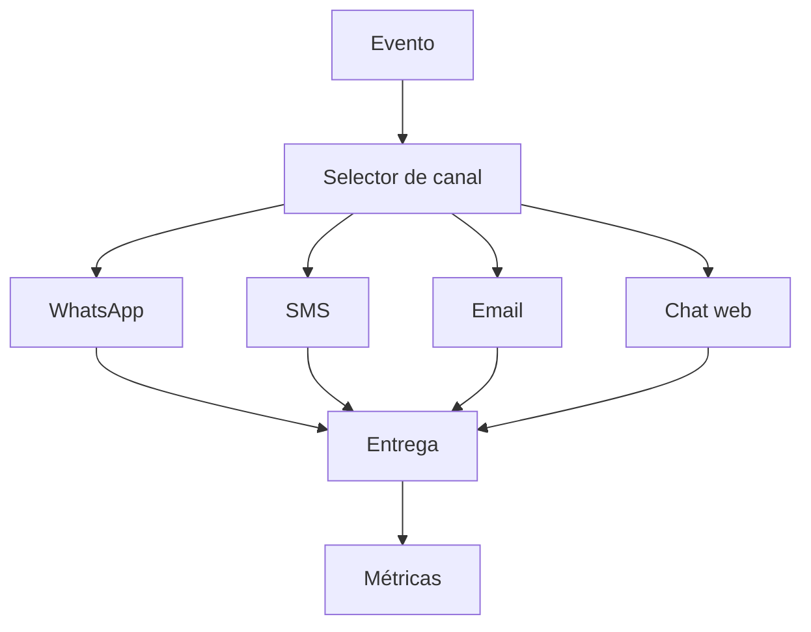

# 💬 Mensajería
*Exportado el 2025-10-23 00:12:33*
---

> **Nota:** Documentación del módulo de mensajería: WhatsApp Business API, SMS, email y chat web.

# 🎯 Objetivo

Unificar la comunicación omnicanal con pacientes, con control, métricas y cumplimiento.

# 🔄 Diagramas de Flujo de Mensajería



# 📊 Matrices de Canales

<!-- Bloque no procesado: table -->

# ⚙️ Configuraciones de APIs

- WhatsApp Business API: plantillas, HSM, webhooks
- SMS: proveedor, remitente, tasas
- Email: DKIM/SPF/DMARC y reputación
- Chat web: autenticación y persistencia
# 🧩 Componentes React

- MensajeriaManager: consola omnicanal
- WhatsAppAPI: integración WA Business
- SMSManager: envíos y métricas SMS
- EmailManager: campañas y reputación
- ChatWeb: widget y sesión
# 🔌 APIs Requeridas

```bash
GET /api/comunicacion/mensajeria
POST /api/comunicacion/whatsapp
GET /api/comunicacion/sms
POST /api/comunicacion/email
GET /api/comunicacion/chat
```

# 🗂️ Estructura MERN

```bash
omnicanal-comunicacion/mensajeria/
├─ page.tsx
├─ api/
│  ├─ whatsapp.ts
│  ├─ sms.ts
│  ├─ email.ts
│  └─ chat.ts
└─ components/
   ├─ MensajeriaManager.tsx
   ├─ WhatsAppAPI.tsx
   ├─ SMSManager.tsx
   ├─ EmailManager.tsx
   └─ ChatWeb.tsx
```

# 📋 Documentación de Procesos

1. Alta de canal y configuración técnica
1. Orquestación de envíos y políticas
1. Monitoreo de métricas y reputación
1. Cumplimiento y auditoría
> **Nota:** Esta página documenta el módulo. Subpáginas por canal podrán añadirse más adelante.

