# 📈 Conversión & Ganancia Esperada
*Exportado el 2025-10-23 00:12:01*
---

# 📈 Conversión & Ganancia Esperada (ERP Dental)

Documentación del sistema de conversión de tratamientos con probabilidades y margen esperado.

## 🔁 Flujo de Conversión

```mermaid
graph TD
  Propuesta[Propuesta de tratamiento] --> Historico[Usar histórico y señales]
  Historico --> Prob[Calcular prob. conversión]
  Prob --> Margen[Calcular margen esperado]
  Margen --> Analisis[Análisis y recomendaciones]
  Analisis --> Seguimiento[Seguimiento y aprendizaje]
```



## 📋 Matriz de Probabilidades

<!-- Bloque no procesado: table -->

## ⚙️ Configuraciones de Margen

- Costo base, descuentos y variaciones
- Margen por tratamiento y paquete
- Segmentos de cliente y sensibilidad
## 🧩 Componentes React (MERN)

```typescript
// ConversionTratamientos.tsx
export function ConversionTratamientos() { /* ... */ }
// ProbabilidadesConversion.tsx
export function ProbabilidadesConversion() { /* ... */ }
// MargenEsperado.tsx
export function MargenEsperado() { /* ... */ }
// AnalisisConversion.tsx
export function AnalisisConversion() { /* ... */ }
// PrediccionesConversion.tsx
export function PrediccionesConversion() { /* ... */ }
```

## 🌐 APIs Requeridas

```json
{
  "GET /api/conversion/tratamientos/:pacienteId": "Obtener tratamientos propuestos",
  "POST /api/conversion/calcular": "Calcular prob. y margen esperado",
  "GET /api/conversion/probabilidades/:id": "Consultar probabilidades",
  "GET /api/conversion/margen/:id": "Consultar margen",
  "GET /api/conversion/analisis": "Resumen y comparativas"
}
```

## 📁 Estructura de Carpetas (MERN)

```bash
planes-tratamiento/
  conversion-ganancia/
    page.tsx
    api/
      get-tratamientos.ts
      post-calcular.ts
      get-probabilidades.ts
      get-margen.ts
      get-analisis.ts
    components/
      ConversionTratamientos.tsx
      ProbabilidadesConversion.tsx
      MargenEsperado.tsx
      AnalisisConversion.tsx
      PrediccionesConversion.tsx
```

## ⚙️ Documentación de Procesos

1. Identificar tratamientos y señales
1. Calcular probabilidad y margen esperado
1. Analizar y priorizar propuestas
> **Nota:** Documentación del módulo de Conversión & Ganancia Esperada.

