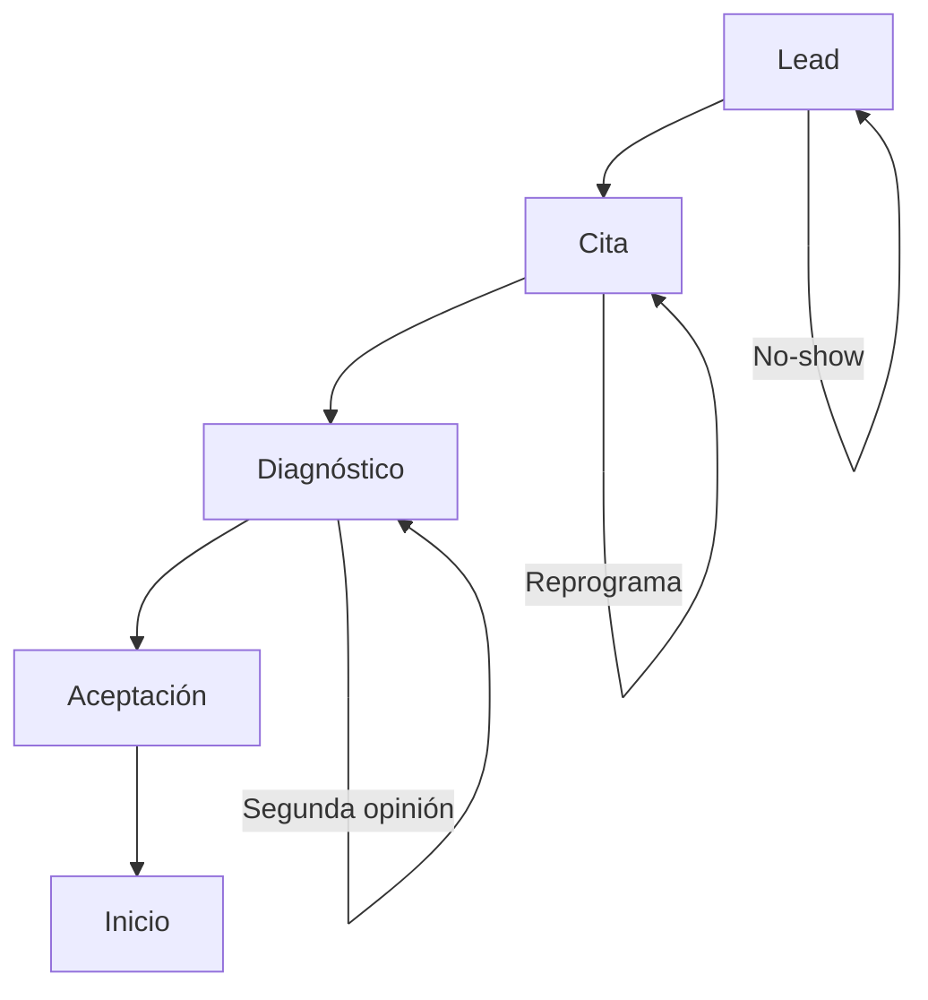
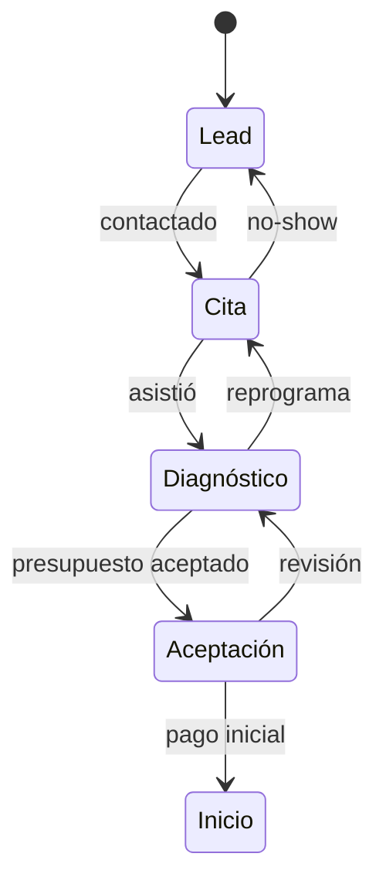

# 📈 Embudo 360
*Exportado el 2025-10-23 00:12:22*
---

> **Nota:** Documentación del módulo Embudo 360 con etapas lead → cita → diagnóstico → aceptación → inicio. Incluye flujos, métricas de conversión, configuración de etapas, componentes y APIs.

# 🎯 Objetivo

Optimizar la conversión a lo largo del ciclo completo del paciente desde el lead hasta el inicio del tratamiento, con visibilidad y control por etapa.

# 🔄 Diagramas de Flujo del Embudo

## 📥 Flujo General



## 🔁 Reglas de Avance/Retroceso



# 📊 Matrices de Conversión

<!-- Bloque no procesado: table -->

# ⚙️ Configuraciones de Etapas

- Definición de criterios de avance por etapa
- Reglas de notificaciones y recordatorios
- Etiquetas y segmentos por etapa
# 🧩 Componentes React

- Embudo360: vista general del embudo
- LeadsManager: gestión de leads y fuentes
- CitasEmbudo: programación y seguimiento de citas
- DiagnosticoEmbudo: diagnóstico y propuesta
- AceptacionEmbudo: aceptación y cierre
# 🔌 APIs Requeridas

```bash
GET /api/marketing/embudo
POST /api/marketing/lead
GET /api/marketing/conversion
POST /api/marketing/etapa
GET /api/marketing/analisis
```

# 🗂️ Estructura MERN

```bash
marketing-ventas/embudo-360/
├─ page.tsx
├─ api/
│  ├─ embudo.ts
│  ├─ lead.ts
│  └─ analisis.ts
└─ components/
   ├─ Embudo360.tsx
   ├─ LeadsManager.tsx
   ├─ CitasEmbudo.tsx
   ├─ DiagnosticoEmbudo.tsx
   └─ AceptacionEmbudo.tsx
```

# 📋 Documentación de Procesos

1. Captación de lead y calificación
1. Agendamiento de cita y recordatorios
1. Diagnóstico y propuesta de tratamiento
1. Aceptación y financiación
1. Inicio y onboarding
> **Nota:** Esta página documenta el módulo. Las subpáginas especializadas por etapa o canal podrán añadirse más adelante.

