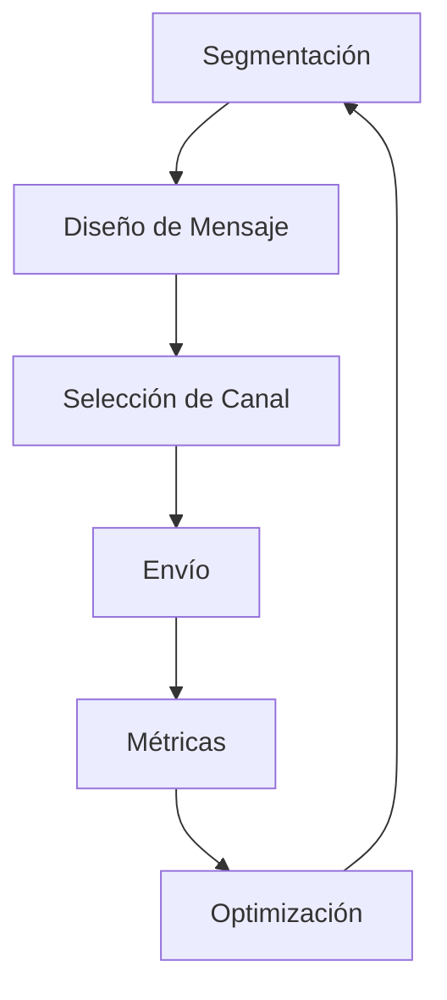
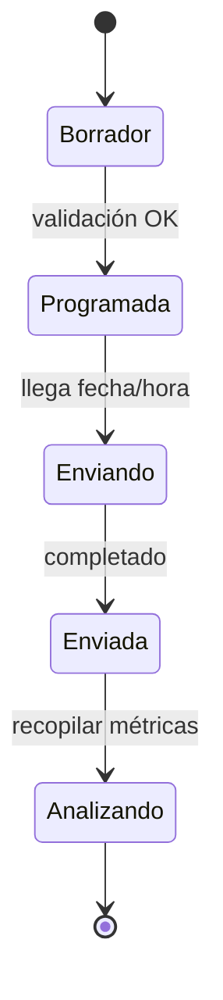

# 📣 Campañas
*Exportado el 2025-10-23 00:12:24*
---

> **Nota:** Documentación del módulo de campañas multicanal (Email/SMS/WhatsApp/Ads). Incluye flujos, matrices de canales, configuraciones, componentes y APIs.

# 🎯 Objetivo

Planificar, ejecutar y medir campañas de marketing multicanal, garantizando cumplimiento normativo y óptima entrega.

# 🔄 Diagramas de Flujo de Campañas

## 🧭 Flujo General



## 📬 Flujo Email/SMS/WhatsApp



# 📊 Matrices de Canales

<!-- Bloque no procesado: table -->

# ⚙️ Configuraciones de Mensajería

- Plantillas por canal y propósito
- Frecuencias y ventanas de envío
- Cumplimiento RGPD/opt-in/out
# 🧩 Componentes React

- CampanasManager: vista general y orquestación
- EmailCampanas: constructor de email y seguimiento
- SMSCampanas: envío y métricas de SMS
- WhatsAppCampanas: plantillas y envíos WA
- AdsCampanas: gestión de campañas pagadas
# 🔌 APIs Requeridas

```bash
GET /api/marketing/campanas
POST /api/marketing/campana
GET /api/marketing/email
POST /api/marketing/sms
GET /api/marketing/whatsapp
```

# 🗂️ Estructura MERN

```bash
marketing-ventas/campanas/
├─ page.tsx
├─ api/
│  ├─ campanas.ts
│  ├─ email.ts
│  ├─ sms.ts
│  └─ whatsapp.ts
└─ components/
   ├─ CampanasManager.tsx
   ├─ EmailCampanas.tsx
   ├─ SMSCampanas.tsx
   ├─ WhatsAppCampanas.tsx
   └─ AdsCampanas.tsx
```

# 📋 Documentación de Procesos

1. Creación y planificación de campaña
1. Ejecución multicanal
1. Medición y análisis
1. Optimización continua
> **Nota:** Esta página documenta el módulo. Las subpáginas por canal o caso de uso pueden añadirse más adelante.

