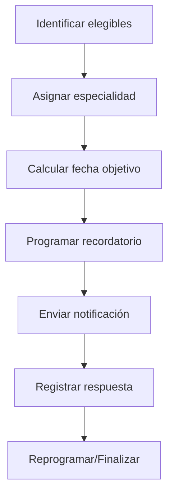

# 🔄 Recall Preventivo
*Exportado el 2025-10-23 00:12:27*
---

> **Nota:** Documentación del módulo de recall preventivo para higienes, ortodoncia, implantes y periodoncia.

# 🎯 Objetivo

Automatizar recordatorios preventivos por especialidad para mejorar adherencia y salud oral.

# 🔄 Diagramas de Flujo de Recall

## 🧭 Flujo General



# 📊 Matrices de Especialidades

<!-- Bloque no procesado: table -->

# ⏱️ Configuraciones de Recordatorios

- Ventanas: -7d, -1d, +3d
- Canales por especialidad
- Plantillas y tokens
# 🧩 Componentes React

- RecallPreventivo: vista general y programación
- HigienesRecall: gestión de higienes preventivas
- OrtoRecall: recordatorios de ortodoncia
- ImplantesRecall: revisiones de implantes
- PeriodonciaRecall: mantenimiento periodontal
# 🔌 APIs Requeridas

```bash
GET /api/marketing/recall
POST /api/marketing/recordatorio
GET /api/marketing/higienes
POST /api/marketing/orto
GET /api/marketing/implantes
```

# 🗂️ Estructura MERN

```bash
marketing-ventas/recall-preventivo/
├─ page.tsx
├─ api/
│  ├─ recall.ts
│  ├─ higienes.ts
│  ├─ orto.ts
│  └─ implantes.ts
└─ components/
   ├─ RecallPreventivo.tsx
   ├─ HigienesRecall.tsx
   ├─ OrtoRecall.tsx
   ├─ ImplantesRecall.tsx
   └─ PeriodonciaRecall.tsx
```

# 📋 Documentación de Procesos

1. Identificación de pacientes elegibles
1. Cálculo de fechas objetivo por especialidad
1. Programación y envío de recordatorios
1. Registro de respuestas y seguimiento
1. Optimización de plantillas y ventanas
> **Nota:** Esta página documenta el módulo. Las subpáginas por especialidad o canal podrán añadirse más adelante.

