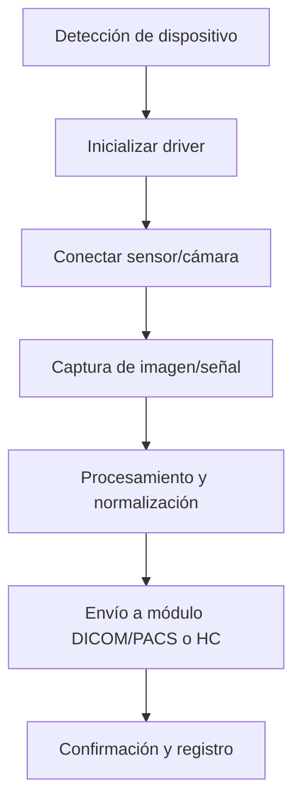

# 🔌 Integración HW
*Exportado el 2025-10-23 00:11:52*
---

# 🔌 Integración HW (ERP Dental)

Documentación del módulo de integración con sensores y cámaras intraorales.

## 🔁 Diagrama de Integración HW



## 📋 Matriz de Sensores

<!-- Bloque no procesado: table -->

## ⚙️ Configuraciones de Cámaras

- Resolución, balance de blancos, exposición
- Perfil de color y compresión
- Calibración y almacenamiento de presets
## 🧩 Componentes React (MERN)

```typescript
// SensoresManager.tsx
export function SensoresManager() { /* ... */ }
// CamarasIntraorales.tsx
export function CamarasIntraorales() { /* ... */ }
// IntegracionHW.tsx
export function IntegracionHW() { /* ... */ }
// ConfiguracionSensores.tsx
export function ConfiguracionSensores() { /* ... */ }
// CalibracionEquipos.tsx
export function CalibracionEquipos() { /* ... */ }
```

## 🌐 APIs Requeridas

```json
{
  "GET /api/hw/sensores": "Listar sensores conectados",
  "POST /api/hw/sensores/conectar": "Conectar/configurar sensor",
  "GET /api/hw/camaras": "Listar cámaras disponibles",
  "POST /api/hw/camaras/configurar": "Configurar cámara",
  "POST /api/hw/calibrar": "Calibrar equipo/sensor"
}
```

## 📁 Estructura de Carpetas (MERN)

```bash
diagnostico-imagen/
  integracion-hw/
    page.tsx
    api/
      get-sensores.ts
      post-conectar-sensor.ts
      get-camaras.ts
      post-configurar-camara.ts
      post-calibrar.ts
    components/
      SensoresManager.tsx
      CamarasIntraorales.tsx
      IntegracionHW.tsx
      ConfiguracionSensores.tsx
      CalibracionEquipos.tsx
```

## ⚙️ Documentación de Procesos

1. Detección y reconocimiento de dispositivos
1. Configuración/Conexión del equipo
1. Captura y envío al repositorio de imágenes
> **Nota:** Documentación del módulo de Integración HW.

