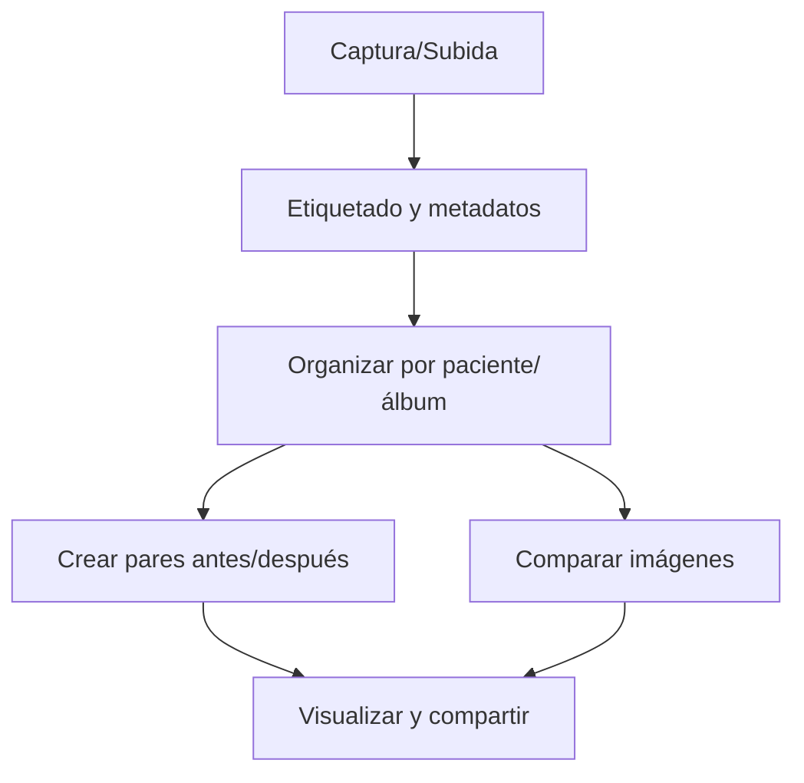

# 🖼️ Galería Multimedia
*Exportado el 2025-10-23 00:11:54*
---

# 🖼️ Galería Multimedia (ERP Dental)

Documentación del módulo de galería multimedia con etiquetado, antes/después y comparación.

## 🔁 Flujo de Galería



## 📋 Matriz de Etiquetado

<!-- Bloque no procesado: table -->

## ⚙️ Configuraciones de Comparativas

- Pares antes/después por etiqueta y fecha
- Comparación lado a lado y con deslizador
- Filtros por tratamiento y visita
## 🧩 Componentes React (MERN)

```typescript
// GaleriaMultimedia.tsx
export function GaleriaMultimedia() { /* ... */ }
// EtiquetadoImagenes.tsx
export function EtiquetadoImagenes() { /* ... */ }
// AntesDespues.tsx
export function AntesDespues() { /* ... */ }
// ComparacionImagenes.tsx
export function ComparacionImagenes() { /* ... */ }
// OrganizadorGaleria.tsx
export function OrganizadorGaleria() { /* ... */ }
```

## 🌐 APIs Requeridas

```json
{
  "GET /api/galeria/:pacienteId": "Listar galería del paciente",
  "POST /api/galeria/subir": "Subir imagen/video",
  "POST /api/galeria/etiquetar": "Etiquetar recurso multimedia",
  "GET /api/galeria/antes-despues/:pacienteId": "Obtener pares antes/después",
  "POST /api/galeria/comparar": "Generar/comparar imágenes"
}
```

## 📁 Estructura de Carpetas (MERN)

```bash
diagnostico-imagen/
  galeria-multimedia/
    page.tsx
    api/
      get-galeria.ts
      post-subir.ts
      post-etiquetar.ts
      get-antes-despues.ts
      post-comparar.ts
    components/
      GaleriaMultimedia.tsx
      EtiquetadoImagenes.tsx
      AntesDespues.tsx
      ComparacionImagenes.tsx
      OrganizadorGaleria.tsx
```

## ⚙️ Documentación de Procesos

1. Carga/ingesta y etiquetado
1. Organización por paciente y tratamiento
1. Comparativas y presentación
> **Nota:** Documentación del módulo de Galería Multimedia.

