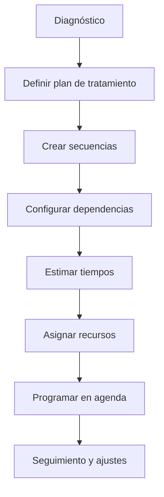

# 🗺️ Planificación
*Exportado el 2025-10-23 00:11:58*
---

# 🗺️ Planificación de Tratamientos (ERP Dental)

Documentación del módulo de planificación de tratamientos con secuencias, dependencias, tiempos estimados y recursos necesarios.

## 🔁 Flujo de Planificación



## 📋 Matriz de Secuencias

<!-- Bloque no procesado: table -->

## ⚙️ Configuraciones de Dependencias

- Relaciones fin-comienzo, comienzo-comienzo, fin-fin
- Buffers y tiempos de espera entre pasos
- Condiciones de habilitación por resultados clínicos
## 🧩 Componentes React (MERN)

```typescript
// PlanificacionTratamientos.tsx
export function PlanificacionTratamientos() { /* ... */ }
// SecuenciasTratamiento.tsx
export function SecuenciasTratamiento() { /* ... */ }
// DependenciasTratamiento.tsx
export function DependenciasTratamiento() { /* ... */ }
// TiemposEstimados.tsx
export function TiemposEstimados() { /* ... */ }
// RecursosNecesarios.tsx
export function RecursosNecesarios() { /* ... */ }
```

## 🌐 APIs Requeridas

```json
{
  "GET /api/tratamientos/planificacion/:pacienteId": "Obtener plan de tratamiento",
  "POST /api/tratamientos/planificar": "Crear/actualizar plan",
  "PUT /api/tratamientos/secuencias/:id": "Actualizar secuencia",
  "GET /api/tratamientos/dependencias/:id": "Consultar dependencias",
  "POST /api/tratamientos/recursos": "Asignar recursos"
}
```

## 📁 Estructura de Carpetas (MERN)

```bash
planes-tratamiento/
  planificacion/
    page.tsx
    api/
      get-planificacion.ts
      post-planificar.ts
      put-secuencias.ts
      get-dependencias.ts
      post-recursos.ts
    components/
      PlanificacionTratamientos.tsx
      SecuenciasTratamiento.tsx
      DependenciasTratamiento.tsx
      TiemposEstimados.tsx
      RecursosNecesarios.tsx
```

## ⚙️ Documentación de Procesos

1. Definición del plan inicial
1. Construcción de secuencias y dependencias
1. Estimación de tiempos y asignación de recursos
1. Programación y seguimiento
> **Nota:** Documentación del módulo de Planificación de Tratamientos.

