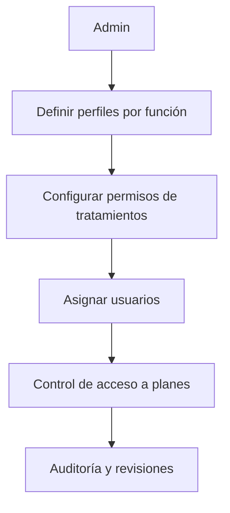

# 🛡️ Gestión de Roles Tratamientos
*Exportado el 2025-10-23 00:12:02*
---

# 🛡️ Gestión de Roles Tratamientos (ERP Dental)

Documentación de roles para Dentistas, Coordinador de tratamientos y Recepción.

## 🔁 Diagrama de Flujo de Roles de Tratamientos



## 🧮 Matriz de Permisos por Función

<!-- Bloque no procesado: table -->

## ⚙️ Configuraciones de Accesos

- Permisos por etapa (planificación, ejecución, cierre)
- Firmas y aprobaciones requeridas
- Auditoría de cambios
## 🧩 Componentes React (MERN)

```typescript
// RolesTratamientosManager.tsx
export function RolesTratamientosManager() { /* ... */ }
// PermisosDentistas.tsx
export function PermisosDentistas() { /* ... */ }
// PermisosCoordinador.tsx
export function PermisosCoordinador() { /* ... */ }
// PermisosRecepcion.tsx
export function PermisosRecepcion() { /* ... */ }
// AccesosTratamientos.tsx
export function AccesosTratamientos() { /* ... */ }
```

## 🌐 APIs Requeridas

```json
{
  "GET /api/tratamientos/roles": "Listar roles",
  "POST /api/tratamientos/roles": "Crear/editar roles",
  "GET /api/tratamientos/permisos": "Listar permisos por rol",
  "POST /api/tratamientos/permisos/asignar": "Asignar permisos a usuarios",
  "GET /api/tratamientos/auditoria": "Eventos de auditoría"
}
```

## 📁 Estructura de Carpetas (MERN)

```bash
planes-tratamiento/
  gestion-roles-tratamientos/
    page.tsx
    api/
      roles.ts
      permisos.ts
      auditoria.ts
    components/
      RolesTratamientosManager.tsx
      PermisosDentistas.tsx
      PermisosCoordinador.tsx
      PermisosRecepcion.tsx
      AccesosTratamientos.tsx
```

## ⚙️ Documentación de Procesos

1. Definir perfiles y responsabilidades
1. Configurar permisos por etapa y acción
1. Asignación y auditoría
> **Nota:** Documentación del módulo de roles para Planes de Tratamiento.

