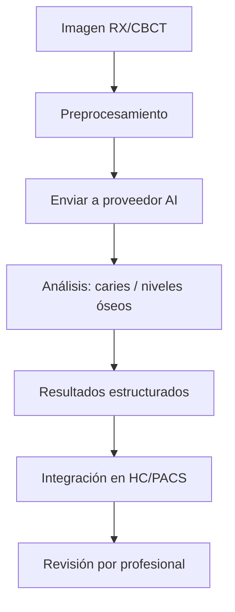

# 🤖 AI Asistida
*Exportado el 2025-10-23 00:11:55*
---

# 🤖 AI Asistida (ERP Dental)

Documentación del módulo de AI asistida (opcional/terceros) para apoyo diagnóstico de caries y niveles óseos mediante integraciones.

## 🔁 Flujo de AI Asistida



## 📋 Matriz de Integraciones

<!-- Bloque no procesado: table -->

## ⚙️ Configuraciones de Terceros

- Autenticación (API Key/OAuth2), gestión de tokens
- Mapeo de campos y formatos (DICOMweb/JSON)
- Trazabilidad y auditoría de inferencias
## 🧩 Componentes React (MERN)

```typescript
// AIDiagnostica.tsx
export function AIDiagnostica() { /* ... */ }
// DeteccionCaries.tsx
export function DeteccionCaries() { /* ... */ }
// NivelesOseos.tsx
export function NivelesOseos() { /* ... */ }
// IntegracionesAI.tsx
export function IntegracionesAI() { /* ... */ }
// ResultadosAI.tsx
export function ResultadosAI() { /* ... */ }
```

## 🌐 APIs Requeridas

```json
{
  "POST /api/ai/analizar": "Enviar imagen/estudio a AI",
  "GET /api/ai/resultados/:id": "Obtener resultados",
  "POST /api/ai/caries/detectar": "Detección específica de caries",
  "POST /api/ai/niveles-oseos": "Estimación de niveles óseos",
  "GET /api/ai/integraciones": "Listar proveedores configurados"
}
```

## 📁 Estructura de Carpetas (MERN)

```bash
diagnostico-imagen/
  ai-asistida/
    page.tsx
    api/
      post-analizar.ts
      get-resultados.ts
      post-deteccion-caries.ts
      post-niveles-oseos.ts
      get-integraciones.ts
    components/
      AIDiagnostica.tsx
      DeteccionCaries.tsx
      NivelesOseos.tsx
      IntegracionesAI.tsx
      ResultadosAI.tsx
```

## ⚙️ Documentación de Procesos

1. Selección de estudio/imagen y preprocesamiento
1. Envío a proveedor y seguimiento de tarea
1. Integración de resultados en HC/PACS y revisión
> **Nota:** Módulo opcional con integraciones de terceros. Requiere cumplimiento de privacidad.

