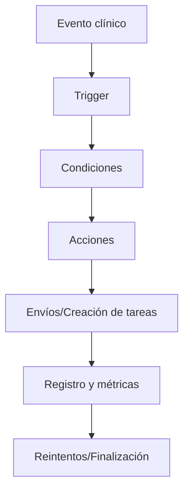

# 🤖 Flujos Automáticos
*Exportado el 2025-10-23 00:12:34*
---

> **Nota:** Documentación del módulo de flujos automáticos: pre/post-operatorio, ausencias y presupuestos sin aceptar.

# 🎯 Objetivo

Automatizar comunicaciones y tareas críticas en momentos clave del ciclo del paciente.

# 🔄 Diagramas de Flujo de Automatización



# 📊 Matrices de Flujos

<!-- Bloque no procesado: table -->

# ⏱️ Configuraciones de Triggers

- Eventos: creación cita, realización, no-show, propuesta enviada
- Condiciones: importe, especialidad, riesgo
- Acciones: enviar mensaje, crear tarea, escalar
# 🧩 Componentes React

- FlujosAutomaticos: vista general y reglas
- PreOperatorio: instrucciones y plantillas
- PostOperatorio: cuidados y encuesta
- AusenciasAutomaticas: no-show y reprogramación
- PresupuestoPendiente: seguimiento de propuestas
# 🔌 APIs Requeridas

```bash
GET /api/comunicacion/flujos
POST /api/comunicacion/trigger
GET /api/comunicacion/pre-operatorio
POST /api/comunicacion/post-operatorio
GET /api/comunicacion/ausencias
```

# 🗂️ Estructura MERN

```bash
omnicanal-comunicacion/flujos-automaticos/
├─ page.tsx
├─ api/
│  ├─ flujos.ts
│  ├─ preOperatorio.ts
│  ├─ postOperatorio.ts
│  └─ ausencias.ts
└─ components/
   ├─ FlujosAutomaticos.tsx
   ├─ PreOperatorio.tsx
   ├─ PostOperatorio.tsx
   ├─ AusenciasAutomaticas.tsx
   └─ PresupuestoPendiente.tsx
```

# 📋 Documentación de Procesos

1. Definición de triggers y condiciones
1. Configuración de acciones y plantillas
1. Monitoreo y reintentos
1. Optimización continua
> **Nota:** Esta página documenta el módulo. Subpáginas por flujo podrán añadirse más adelante.

