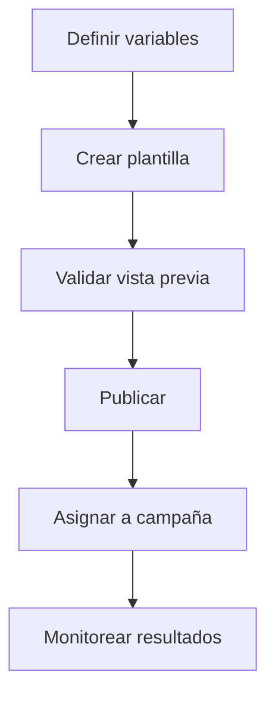

# 🧩 Plantillas & Campañas
*Exportado el 2025-10-23 00:12:35*
---

> **Nota:** Documentación del módulo de plantillas y campañas con variables clínicas.

# 🎯 Objetivo

Estandarizar la comunicación con plantillas dinámicas utilizando variables clínicas y orquestar campañas basadas en ellas.

# 🔄 Diagramas de Flujo de Plantillas



# 📊 Matrices de Variables Clínicas

<!-- Bloque no procesado: table -->

# ⚙️ Configuraciones de Campañas

- Asignación de plantilla por canal
- Ventanas de envío y cadencias
- Variables obligatorias y opcionales
# 🧩 Componentes React

- PlantillasManager: catálogo y validación
- CampanasPlantillas: asociación a campañas
- VariablesClinicas: fuentes y formatos
- EditorPlantillas: editor y previsualización
- GestorCampanas: orquestación y métricas
# 🔌 APIs Requeridas

```bash
GET /api/comunicacion/plantillas
POST /api/comunicacion/plantilla
GET /api/comunicacion/variables
POST /api/comunicacion/campana
GET /api/comunicacion/editor
```

# 🗂️ Estructura MERN

```bash
omnicanal-comunicacion/plantillas-campanas/
├─ page.tsx
├─ api/
│  ├─ plantillas.ts
│  ├─ variables.ts
│  ├─ campana.ts
│  └─ editor.ts
└─ components/
   ├─ PlantillasManager.tsx
   ├─ CampanasPlantillas.tsx
   ├─ VariablesClinicas.tsx
   ├─ EditorPlantillas.tsx
   └─ GestorCampanas.tsx
```

# 📋 Documentación de Procesos

1. Definición de variables clínicas
1. Creación y prueba de plantilla
1. Asignación a campaña y envío
1. Monitoreo y optimización
> **Nota:** Esta página documenta el módulo. Subpáginas por tipo de plantilla o campaña podrán añadirse más adelante.

