# 🩻 DICOM/PACS
*Exportado el 2025-10-23 00:11:51*
---

# 🩻 DICOM/PACS (ERP Dental)

Documentación del módulo DICOM/PACS para RX y CBCT con visor, mediciones y anotaciones.

## 🔁 Diagrama de Flujo DICOM

```mermaid
graph TD
  Adquisicion[Adquisición RX/CBCT] --> Ingreso[Ingreso en PACS]
  Ingreso --> Indexado[Indexado por paciente/estudio]
  Indexado --> Visor[Abrir en visor DICOM]
  Visor --> Mediciones[Realizar mediciones]
  Visor --> Anotaciones[Agregar anotaciones]
  Mediciones --> Guardar[Guardar en PACS]
  Anotaciones --> Guardar
  Guardar --> Compartir[Compartir/Exportar]
```



## 📋 Matriz PACS

<!-- Bloque no procesado: table -->

## ⚙️ Configuraciones de Visores

- Herramientas: zoom, pan, rotación, invert, window/level
- Mediciones: distancias, ángulos, áreas
- Anotaciones: etiquetas, flechas, regiones
## 🧩 Componentes React (MERN)

```typescript
// DicomViewer.tsx
export function DicomViewer() { /* ... */ }
// PacsManager.tsx
export function PacsManager() { /* ... */ }
// RXViewer.tsx
export function RXViewer() { /* ... */ }
// CBCTViewer.tsx
export function CBCTViewer() { /* ... */ }
// MedicionesImagen.tsx
export function MedicionesImagen() { /* ... */ }
// AnotacionesImagen.tsx
export function AnotacionesImagen() { /* ... */ }
```

## 🌐 APIs Requeridas

```json
{
  "GET /api/dicom/estudios/:pacienteId": "Listar estudios por paciente",
  "POST /api/dicom/subir": "Subir estudio/imagen DICOM",
  "GET /api/dicom/imagen/:id": "Obtener imagen/serie",
  "POST /api/dicom/mediciones": "Guardar mediciones",
  "POST /api/dicom/anotaciones": "Guardar anotaciones"
}
```

## 📁 Estructura de Carpetas (MERN)

```bash
diagnostico-imagen/
  dicom-pacs/
    page.tsx
    api/
      get-estudios.ts
      post-subir.ts
      get-imagen.ts
      post-mediciones.ts
      post-anotaciones.ts
    components/
      DicomViewer.tsx
      PacsManager.tsx
      RXViewer.tsx
      CBCTViewer.tsx
      MedicionesImagen.tsx
      AnotacionesImagen.tsx
```

## ⚙️ Documentación de Procesos

1. Ingreso y indexado de estudios DICOM
1. Visualización, mediciones y anotaciones
1. Almacenamiento y exportación
> **Nota:** Documentación del módulo DICOM/PACS.

